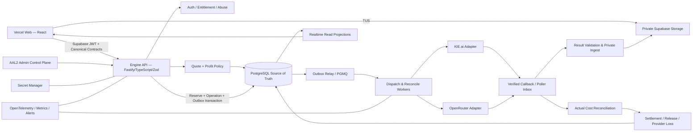
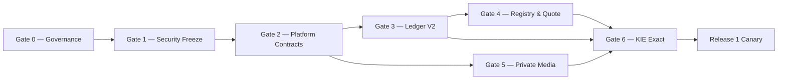

# FusionLab — Professional Master Plan: Platform with Engine

> **Document ID:** `FL-PMP-001`<br>
> **الإصدار:** `1.1.0`<br>
> **الحالة:** `CANONICAL BASELINE — المصدر التنفيذي الوحيد`<br>
> **تاريخ التثبيت:** 11 أغسطس 2026 — Asia/Baghdad<br>
> **النطاق:** منصة FusionLab، الـCreative Space، المحرك المالي والتشغيلي، KIE.ai وOpenRouter فقط<br>
> **المالك:** Product Owner؛ والتنفيذ بتوقيع Engineering + Security + Finance حسب البوابة<br>
> **يستبدل كليًا:** كل Master Plan أو Creative/Engine Draft أو Migration Guide سابق في المستودع

## 0. سلطة الوثيقة وطريقة العمل بها

هذه الوثيقة هي الخطة المعيارية الوحيدة لبناء FusionLab. لا تُجمع مع خطة سابقة، ولا يجوز تنفيذ بند من وثيقة محذوفة أو من Git history لمجرد أنه كان موجودًا. Git history دليل تاريخي فقط.

ترتيب السلطة:

1. هذه الوثيقة ونسختها المثبتة.
2. عقود الـAPI والـSchemas والـADRs التي تنفذها ولا تناقضها.
3. Runbooks وTickets وPRs التابعة للمرحلة.
4. وثائق المزود الرسمية ونتائج الـCanary المؤرخة.

إذا ظهر تعارض، يتوقف التنفيذ ويُفتح Change Proposal. لا يتغير القرار بصمت داخل الكود. تعديل الخطة يحتاج PR، سببًا، أثرًا ماليًا وأمنيًا، مراجعين مناسبين، وتحديث Changelog.

### 0.1 قاعدة المرحلة

لا تبدأ مرحلة قبل:

- إكمال Dependencies السابقة.
- إرفاق أدلة Gate السابقة.
- وجود Rollback/Forward-fix قابل للتنفيذ.
- عدم وجود P0 مفتوح ضمن مسار المرحلة.
- توقيع أصحاب الصلاحية المذكورين.

### 0.2 ما تعنيه الكلمات

- **MUST / إلزامي:** شرط إطلاق لا يجوز تجاوزه.
- **SHOULD / مرجح:** ينفذ ما لم يسجل ADR يثبت بديلًا أفضل.
- **MAY / لاحق:** خيار لا يدخل المسار الحرج.
- **PROHIBITED / محظور:** لا ينفذ حتى بقرار سريع من Admin؛ يحتاج تغيير هذه الخطة.

### 0.3 Changelog

| الإصدار | التاريخ | القرار |
|---|---|---|
| 1.1.0 | 2026-08-11 | تحويل الخطة إلى Execution-ready baseline: تثبيت حدود Release 1، المسار الحرج، RACI، Definition of Ready، عقود الانتقالات والأحداث، حزمة بيانات وأمن وتشغيل، Traceability، وقالب Gate Evidence ملزم |
| 1.0.0 | 2026-08-11 | استبدال الخطط المتعارضة؛ تثبيت Whole Credits، Certified Profit-Aware Engine، Standard Assisted Graph، ومراحل Strangler Migration |

---

## 1. القرار التنفيذي النهائي

نطوّر **نفس المنتج والدومين والمستودع وحسابات Supabase ومعرّفات المستخدمين**. لا نعيد إنشاء المستخدمين، ولا ننقلهم إلى تطبيق منافس، ولا نبني Backend منفصلًا لكل وضع UI.

المنتج المستهدف:

```text
Full-browser Creative Project Workspace
+ Floating Inspector on Desktop
+ Bottom Dock/Sheets on Mobile
+ Asset and Operation Cards
+ One Domain Graph
+ Standard Assisted View
+ Professional Node View later
+ Certified Profit-Aware Routing Engine
+ Whole-credit Wallet and Immutable Ledger
+ KIE/OpenRouter Certified Routes
```

المحرك الرسمي:

```text
Catalog → Quote → Reserve → Route → Dispatch
→ Verify → Ingest → Deliver → Reconcile → Settle → Profit Analytics
```

هو محرك Backend حتمي. لا LLM ولا Agent حر يقرر السعر أو الخصم أو يحرك الأموال أو ينشر مفتاحًا. يمكن لوكيل استشاري أن يقترح ويحاكي وينبه، لكن النشر يمر بقواعد ثابتة وموافقة بشرية.

تعريف الـRouting المهني:

> اختيار أقل تكلفة متوقعة لنتيجة صالحة ومتكافئة من Routes موثقة، ذات سعر حديث ورصيد وصحة وجودة كافية، ضمن الخصوصية وهامش الربح والـQuote الذي وافق عليه المستخدم.

ليس الهدف اختيار أرخص رقم اسمي، ولا فحص صفحات الويب لحظة Generate، ولا الوعد بأرخص سعر عالمي أو ربح مضمون.

---

## 2. رؤية المنتج وعقد المستخدم

### 2.1 هدف المستخدم

يستطيع مستخدم قليل الخبرة:

1. إنشاء مشروع.
2. رفع صورة أو فيديو أو صوت داخل الـSpace.
3. تحديد الأصل واختيار Edit أو Upscale أو Animate أو Avatar.
4. رؤية النماذج المتوافقة فقط والإعدادات الحقيقية فقط.
5. رؤية السعر النهائي بالكريديت قبل Generate.
6. الحصول على نتيجة بجانب الأصل من دون فقده.
7. تحديد النتيجة ومتابعة سلسلة العمل منها.

ويستطيع المستخدم المحترف لاحقًا فتح المشروع نفسه في Professional View لرؤية Operations وPorts وEdges من دون Migration أو Backend ثانٍ.

### 2.2 وعود المنصة

- السعر الذي وافق عليه المستخدم لا يرتفع بعد التأكيد.
- لا تبديل سري لنموذج مختلف في Exact Mode.
- لا خصائص وهمية أو إعدادات لا يقبلها Route.
- لا خصم نهائي مقابل نتيجة لم تُسلّم صالحة.
- الأصل لا يُستبدل؛ كل تعديل فرع جديد قابل للتتبع.
- ملفات المستخدم خاصة افتراضيًا.
- Refresh أو تغيير الجهاز لا يفقد المشروع أو المهمة.
- التقدم المعروض حقيقي أو مرحلي؛ لا نسبة مئوية مصطنعة.
- المستخدم يرى Whole Credits مثل `10` أو `70`، لا كسورًا ولا ×1000.

### 2.3 مؤشرات نجاح المنتج

- مستخدم جديد ينشئ صورة ثم يحولها إلى فيديو من دون تدريب مباشر.
- 100% من العمليات المدفوعة تحمل Quote وReservation ونسخ Manifest/Price/Policy.
- صفر terminal transition مصدره JWT مستخدم.
- صفر Ledger drift غير مفسر.
- كل Route نشط اجتاز Capability وBilling Canary ومصالحة Actual Cost.
- كل نتيجة دائمة مخزنة في Storage الخاص بنا.
- لا Critical/High أمني مفتوح عند GA.
- Web Vitals وCanvas budgets في قسم الأداء مستوفاة.

---

## 3. خط الأساس الحالي والمشكلات المثبتة

### 3.1 ما يستحق الاحتفاظ به

| الأصل الحالي | القرار |
|---|---|
| React 18 + Vite + TypeScript | يبقى ويُنظم تدريجيًا |
| Tailwind + shadcn/Radix | Design System أساس |
| TanStack Query | Server state فقط |
| Framer Motion | انتقالات قصيرة ومحترمة لـReduced Motion |
| Supabase Auth | يبقى مع تقوية AAL2/RBAC |
| PostgreSQL + RLS | المصدر القانوني للبيانات والمال |
| Supabase Storage | يبقى بعد تحويله إلى Private Pipeline |
| Supabase Realtime | Read projections/events فقط |
| UUIDs والحسابات والباقات الحالية | بيانات Migration لا منطق نهائي |
| فكرة validate/reserve/settle | يعاد بناؤها ذريًا في V2 |
| Admin shell والمكونات الصغيرة القابلة للفصل | يعاد استخدامها بصريًا بعد إزالة الكتابات المباشرة |

### 3.2 مخاطر P0 الحالية

| الخطر | موضعه | العلاج الإلزامي |
|---|---|---|
| المتصفح يرسل success/failure/refund/file URL | `supabase/functions/complete-generation` و`use-generation-queue` | Server webhook/poller وحده يقرر Terminal |
| Service Role مستخدم كـ`x-internal-caller` | `start-generation` و`kie-ai` | HMAC مستقل أو استدعاء Worker داخلي؛ تدوير المفتاح |
| Idempotent reservation قد يعقبه Dispatch جديد | `start-generation` | Operation/Attempt/Outbox وقيود فريدة |
| Network timeout قد يحرر حجز مهمة وصلت | `start-generation` | `SUBMISSION_UNKNOWN`، لا Refund أو Retry أعمى |
| المستخدم يستطيع INSERT/UPDATE على jobs | RLS لـ`generation_jobs` | lifecycle Server-owned |
| دوال مالية حساسة بلا REVOKE صريح كافٍ | migrations الحالية | أقل صلاحية وWorker role فقط |
| انتهاء الاشتراك يصفر Wallet كاملًا | `enforce_subscription_expiry` | انتهاء Lot الاشتراك فقط |
| stale cron يعيد الرصيد بالعمر | `cleanup_stale_reservations` | Reconciliation evidence، لا Time-only refund |
| ملفات generations/temp عامة | Storage migrations الأخيرة | Private buckets وSigned URLs |
| Admin يحذف بيانات مالية من المتصفح | `UserManagement.tsx` | Anonymization + immutable financial retention |
| KIE task status غير مربوط بمالك Job | `kie-ai` | Internal-only lookup مربوط بالـOperation |
| Response/Payload logs خام | provider functions | Redaction وstructured evidence محدود |

### 3.3 ديون هندسية حالية

- `StudioPage.tsx` نحو 2487 سطرًا ويخلط UI والمزوّد والتسعير والـpolling والنتيجة.
- `AdminPage.tsx` نحو 942 سطرًا ويكتب في جداول حساسة مباشرة.
- `tools.ts` و`model-capabilities.ts` Catalog صلب قابل للانجراف.
- `pricing-engine.ts` في المتصفح ومحرك SQL القديم قد يعطيان نتائج مختلفة.
- الاختبارات الفعلية شبه معدومة، والـlint يحتوي ديونًا كبيرة.
- الـbundle الرئيسي كبير ويحتاج code splitting.
- GitHub أبلغ عند هذا الخط الأساسي عن Dependency findings يجب إغلاقها قبل GA.

هذه حقائق Migration وليست مبررًا لـBig Bang Rewrite. نستخدم Strangler Pattern وFeature Flags.

---

## 4. القرارات غير القابلة للتفاوض

1. `1 FusionLab Credit = 1 displayed whole credit`.
2. لا `credit_units ×1000` ولا ترحيل بضرب الأرصدة.
3. Customer Credits وProvider Units وMoney ثلاث حقائق منفصلة.
4. المتصفح غير موثوق للمال وحالة المزود.
5. Ledger وVersions وProvider evidence Append-only.
6. كل تصحيح مالي Compensating Journal، لا Update/Delete.
7. Unknown Cost ليس صفرًا؛ Unknown Dispatch ليس فشلًا.
8. Model Family غير Provider Route.
9. Exact وSmart منتجان مختلفان وواضحان.
10. Routing يعتمد Certified Cached Snapshots، لا Web lookup لكل Generate.
11. لا Provider Route من دون Formula وActual Cost extractor وKill switch.
12. لا Secret في React أو Git أو response أو log أو جدول يقرؤه المتصفح.
13. Admin ينشر Version؛ لا يعدل Production row مباشرة.
14. Standard وProfessional عرضان لنفس Domain Graph.
15. كل تعديل Media غير هدّام ويحفظ Lineage.
16. كل Drag/Touch له بديل Click/Keyboard.
17. لا Progress وهمي ولا Unsupported setting.
18. لا Unlimited شامل أو Hidden cap/substitution.
19. لا Agent مستقل ينشر سعرًا أو يحرك مالًا أو سرًا.
20. Rollback لا يعيد أي سلوك P0 قديم.

---

## 5. المعمارية الإنتاجية المستهدفة



### 5.1 أسلوب النشر

- Web على Vercel أو المضيف الحالي تحت الدومين نفسه.
- Supabase يبقى Auth/Postgres/RLS/Storage/Realtime/PGMQ.
- Engine API والWorkers يبدأان Docker services على VPS نفسه.
- يمكن استخدام `api.<domain>` خلف TLS؛ تجربة المستخدم تبقى على الدومين الحالي.
- لا نبدأ بعشرات Microservices. نستخدم Modular Monolith مع Processes مستقلة للـAPI والWorker.
- Temporal وRedis وOpenMeter إضافات لاحقة فقط بعد إثبات الحاجة؛ ليست مصدر الحقيقة المالي.

### 5.2 حدود الثقة

| المنطقة | الثقة | المسموح |
|---|---|---|
| Browser | غير موثوق | Draft، Upload intent، Quote request، Confirm، Read own projection |
| Engine API | موثوق مشروط | AuthZ، Validation، Quote، Atomic commands |
| Worker | داخلي | Dispatch، Polling، terminal evidence، ingest، settlement |
| PostgreSQL | Source of Truth | Constraints، journals، versions، state transitions |
| Provider | خارجي غير موثوق | Raw events تحفظ كدليل وتُطبع قبل الاستخدام |
| Admin | حساس | AAL2 + RBAC + maker-checker + audit |
| Advisor Agent | استشاري | Read sanitized metrics، propose/simulate فقط |

### 5.3 مبادئ الاعتمادية

- At-least-once delivery مع Idempotent consumers.
- Transactional Outbox/Inbox.
- One external task per Attempt.
- State machine انتقالاتها server-only.
- Webhook replay protection وتحقق raw-body HMAC.
- Poller fallback حين لا يملك المزود Webhook موثوقًا.
- Result delivery لا تعد نجاحًا قبل التخزين والتحقق.

---

## 6. هيكل المستودع وطريقة كتابة الكود

الهدف بعد Migration تدريجي، لا نقل شامل في PR واحد:

```text
apps/
  web/                         # React: studio + admin routes, code-split
  engine-api/                  # Fastify ingress and commands
  webhook-ingress/             # minimal raw-body verification boundary
  worker/                      # queue consumers/schedulers/reconciliation
packages/
  contracts/                   # Zod schemas, error codes, event contracts
  domain/                      # projects/assets/operations/state machines
  billing/                     # quotes, ledger, lots, pricing formulas
  routing/                     # gates, scores, exact/smart policies
  provider-kie/                # adapter + fixtures + contract tests
  provider-openrouter/         # adapter + fixtures + contract tests
  observability/               # logging, tracing, redaction
  ui/                          # design system primitives
supabase/
  migrations/
  tests/
  seed/
docs/
  PROFESSIONAL_MASTER_PLAN_PLATFORM_WITH_ENGINE_AR.md
  README.md
  TRANSFER_BASELINE.md
```

### 6.1 اتجاه الاعتماد

```text
UI → contracts
Engine API → contracts + domain + billing + routing
Workers → domain + billing + routing + provider adapters
Provider adapters → contracts only
Domain/Billing → no React, no provider SDK, no HTTP framework
```

لا يستورد Billing من UI، ولا يقرأ UI جدول Provider مباشرة، ولا يسمح Adapter بتعديل Ledger.

### 6.2 معايير الكتابة

- TypeScript `strict`؛ منع `any` الجديد إلا Boundary موثق يتحول فورًا إلى Schema.
- Zod validation عند كل Trust boundary.
- أسماء Domain ثابتة، ولا تنتشر أسماء KIE/OpenRouter داخل مكونات المنتج.
- Money/Credits لا تستخدم `number` أو Float في الحساب؛ تستخدم `bigint` أو decimal parser دقيق.
- Formula DSL declarative whitelist؛ لا `eval` ولا JavaScript من Admin.
- Migrations forward-only بنمط Expand → Backfill → Verify → Cutover → Contract.
- كل Command يحتاج idempotency key حين يمكن تكراره.
- كل Event يحمل `event_id`, `schema_version`, `occurred_at`, `correlation_id`, `causation_id`.
- Structured logs بلا prompts كاملة أو secrets أو provider payload خام.
- Feature flags server-evaluated للمال والمسارات، وليست حماية UI فقط.

### 6.3 سياسة PR

كل PR يذكر:

- Acceptance criteria.
- Threat impact وFinancial impact.
- Migration/compatibility.
- Telemetry.
- Test evidence.
- Rollback أو Forward-fix.
- مراجعة ثانية إلزامية لأي Auth/RLS/Ledger/Secret/Pricing change.

---

## 7. Domains وملكية البيانات

### 7.1 Identity & Access

- Supabase Auth يملك المستخدم والجلسة.
- `profiles` بيانات عرض، لا صلاحيات.
- RBAC canonical roles في DB.
- AAL2/MFA إلزامي للإدارة الحساسة.
- Ban/plan/quota/concurrency تفحص Server-side عند كل عملية.

### 7.2 Project Graph

- Project هو حدود الملكية والحفظ.
- Asset أصل أو نتيجة محفوظة.
- Operation فعل توليد/تعديل مستقل.
- Binding يربط Asset بدور Semantic داخل Operation.
- Canvas Item Presentation فقط؛ لا يحمل السعر أو حالة المزود.
- Lineage يربط كل Output بالـOperation والـInputs والنسخ.

### 7.3 Registry

- Model Family/Version هو الاسم المنتج.
- Provider Route هو endpoint محدد لدى KIE أو OpenRouter.
- Recipe يصف عملية المنتج ومدخلاتها ومخرجاتها.
- Capability Version يصف ما يقبله Route فعلًا.
- Cost Version وCustomer Price Version منفصلان.

### 7.4 Orchestration

- Operation تمثل نية المستخدم.
- Attempt يمثل محاولة Provider واحدة.
- Provider Event دليل خارجي.
- Result Ingest عملية مستقلة قابلة لإعادة المحاولة.
- Reconciliation يوثق estimated/actual/variance.

### 7.5 Billing & Commerce

- Credit Ledger مصدر الحقيقة للكريديت.
- Wallet Projection Cache قابل لإعادة البناء.
- Credit Lots تحفظ المصدر والأهلية والقيمة الاقتصادية.
- Provider Funding Lots تحفظ Cash COGS الفعلي.
- Payments/Subscriptions/Promotions تمنح Lots عبر Events موثقة.

### 7.6 Operations & Governance

- Admin change sets وVersions وApprovals.
- Audit events غير قابلة للحذف.
- Incidents وKill switches وRunbooks.
- Advisor proposals منفصلة عن Published decisions.

---

## 8. نموذج البيانات القانوني V2

### 8.1 قواعد عامة

- UUID لكل كيان.
- `created_at`, `updated_at` عند الحاجة؛ immutable tables لا `updated_at` لها.
- كل Version يحمل `effective_from`, `retired_at`, `source_hash`, `created_by`.
- كل جدول مالي أو تشغيلي حساس يمنع كتابة المستخدم عبر RLS وPrivileges.
- DB constraints تفرض Invariants، لا TypeScript وحده.

### 8.2 جداول المشاريع والـSpace

```text
projects
project_members
project_revisions
assets
asset_variants
asset_metadata
operations
operation_inputs
operation_outputs
canvas_items
saved_viewports
```

أهم الحقول:

```text
assets:
  id, project_id, owner_id, origin, media_type, status
  storage_object_id, proxy_object_id, checksum
  width, height, duration_ms, fps, has_audio

operations:
  id, project_id, owner_id, recipe_version_id, mode
  prompt_document, settings_snapshot, state
  quote_id, reservation_id, created_at

operation_inputs:
  operation_id, asset_id, semantic_role, ordinal, alias, snapshot_hash

canvas_items:
  project_id, entity_type, entity_id, x, y, width, height, z_index, collapsed
```

### 8.3 جداول Registry والتسعير

```text
model_families
model_family_versions
recipes
recipe_versions
provider_accounts
provider_routes
route_capability_versions
route_billing_manifests
provider_cost_sources
provider_cost_versions
exact_equivalence_groups
exact_equivalence_members
customer_product_skus
customer_price_books
customer_price_versions
routing_policy_versions
```

### 8.4 جداول العمليات

```text
generation_operations
generation_attempts
quote_candidates
routing_decisions
outbox_events
inbox_events
provider_events
provider_usage_events
cost_reconciliations
```

قيود أساسية:

```text
UNIQUE(user_id, idempotency_key) on operation
UNIQUE(operation_id) WHERE reservation is active
UNIQUE(operation_id, attempt_number)
UNIQUE(provider_account_id, external_task_id)
UNIQUE(provider, delivery_id) on inbox
UNIQUE(provider, provider_usage_id)
```

### 8.5 جداول الكريديت والمال

```text
credit_accounts
credit_journals
credit_ledger_entries
credit_lots
credit_lot_allocations
credit_reservations
wallet_projections
provider_funding_lots
provider_balance_snapshots
provider_commitments
provider_treasury_policies
provider_recharge_requests
payment_events
subscription_versions
promotion_versions
promotion_budgets
promotion_redemptions
promotion_subsidy_entries
```

### 8.6 Invariants قاعدة البيانات

1. مجموع Entries في كل Credit Journal يساوي صفرًا.
2. `available` و`held` لا يصبحان سالبين.
3. مجموع حالات Lot يساوي `granted`.
4. Wallet Projection يطابق Sum Ledger.
5. كل Financial Journal له idempotency key فريد.
6. كل Operation تثبت Versions المستخدمة.
7. كل Attempt يملك external task واحدًا كحد أقصى.
8. Published Version لا تعدل.
9. لا UPDATE/DELETE على Ledger/Cost/Event history.
10. لا Settlement يتجاوز Customer Quote.

---

## 9. العقود العامة والـState Machines

### 9.1 Endpoints المستخدم

```text
GET    /v2/projects
POST   /v2/projects
GET    /v2/projects/:id
PATCH  /v2/projects/:id/layout
POST   /v2/assets/upload-intents
POST   /v2/assets/:id/finalize-upload
GET    /v2/catalog/recipes
POST   /v2/quotes
POST   /v2/operations                 # Quote + Idempotency-Key required
GET    /v2/operations/:id
POST   /v2/operations/:id/cancel      # only where semantics allow
GET    /v2/projects/:id/activity
```

لا Endpoint عام يقبل `provider_model_id`, `provider task id`, raw payload, terminal status, refund flag أو actual cost.

### 9.2 Quote request

```json
{
  "projectId": "uuid",
  "product": "video.generate",
  "mode": "exact",
  "familyVersionId": "uuid",
  "inputs": {
    "durationSeconds": 10,
    "resolution": "720p",
    "audio": true,
    "references": [{"assetId": "uuid", "role": "first_frame"}]
  },
  "settings": {},
  "promotionCode": null
}
```

Quote response العام يعرض Whole Credits، الخصم، مدة الصلاحية، Mode، والخصائص المثبتة. لا يعرض Internal COGS أو secret route metadata.

### 9.3 إنشاء العملية

`POST /v2/operations` يرسل `quote_id`, `Idempotency-Key`, input snapshots وrequest hash. معاملة واحدة:

1. تتحقق من Quote وOwner/Entitlement/hash/expiry.
2. تقفل Wallet/Lots المؤهلة.
3. تنشئ Operation وReservation.
4. تنقل Available → Held.
5. تنشئ Outbox event.
6. تعمل Commit وتعيد `202 Accepted`.

لا يُستدعى المزود داخل HTTP transaction.

### 9.4 Operation state machine

```text
DRAFT → QUOTED → RESERVED → QUEUED → DISPATCHING
→ SUBMITTED → RUNNING → PROVIDER_SUCCEEDED
→ ASSET_STORED → DELIVERED → SETTLED
```

مسارات الاستثناء:

```text
DISPATCHING → SUBMISSION_UNKNOWN
SUBMITTED/RUNNING → PROVIDER_FAILED
PROVIDER_SUCCEEDED → DELIVERY_FAILED
* → RECONCILIATION_REQUIRED
eligible states → CANCELLED
```

- `SUBMISSION_UNKNOWN` لا يحرر ولا يعيد الإرسال تلقائيًا.
- Provider success لا يساوي User delivery.
- فشل التخزين بعد نجاح المزود يعيد Download/Ingest؛ عند العجز النهائي يتحمل النظام Provider Loss ويحرر المستخدم.
- لا تكلفة إضافية على المستخدم بعد Quote.

### 9.5 Reservation state

```text
HELD → SETTLED
HELD → RELEASED
HELD → MANUAL_REVIEW
```

لا يوجد time-only release. كل Release يحمل Evidence reason.

### 9.6 Event processing

- التحقق من توقيع Webhook على raw body.
- نافذة Timestamp وReplay cache/Inbox unique key.
- تخزين Raw evidence مشفرًا/محدودًا قبل normalization.
- State transition compare-and-set.
- Duplicate/out-of-order event لا يكرر مالًا أو Job.

---

## 10. Model Registry وProvider Certification

### 10.1 الفصل القانوني

```text
Product Recipe
→ Model Family Version
→ one or more Provider Routes
→ Capability Version + Billing Manifest + Cost Version
```

لا يكفي تطابق الاسم لإثبات أن KIE وOpenRouter يقدمان النتيجة نفسها.

### 10.2 Route Manifest الإلزامي

كل Route يحمل:

- Provider account وprovider model ID.
- Canonical family/version.
- input modes وsemantic slots.
- عدد وترتيب المراجع وaliases.
- first/last frame وaudio semantics.
- resolutions، durations، aspect ratios، FPS.
- output type/audio.
- Billing basis وtyped parameters.
- Source URL/snapshot/hash/timestamp.
- Cost freshness policy.
- Actual usage extractor.
- Failure/refund semantics.
- Privacy/retention/data-region.
- Adapter version.
- Canary evidence وowner وkill switch.

### 10.3 Billing Formula DSL

الأنواع المدعومة:

```text
per_output_second
per_input_plus_output_second
per_generation
per_video
per_image
per_resolution
per_character_block
per_audio_second
per_token
base_plus_addons
tiered_duration
actual_usage_only
```

DSL عبارة عن JSON typed ورقم Rational، لا JavaScript. Unknown formula يعطل Route.

### 10.4 Certification lifecycle

```text
DRAFT → VALIDATED → CANARY → CERTIFIED → PUBLISHED
→ SUSPENDED → RETIRED
```

لا يدخل Route الإنتاج قبل:

- Capability contract tests.
- Golden billing fixtures.
- طلب Canary حقيقي.
- استخراج Actual Cost.
- Result ingest.
- failure/refund test.
- privacy review.
- margin shock simulation.

### 10.5 Exact Equivalence

Cross-provider في Exact Mode يحتاج Group معتمد يطابق:

- الإصدار الفعلي.
- input/output semantics.
- references/first/last/audio.
- الدقة والمدة.
- safety وdata policy.
- quality contract.

إن لم يثبت، يبقى كل Route Exact منفردًا أو يطلب المستخدم Smart Mode.

### 10.6 Catalog المستخدم

- قائمة مختارة حسب Recipe، غالبًا Recommended/Fast/Premium.
- `See all compatible` يعرض فقط Certified compatible routes/families.
- لا تثبت أسعار أو كل أسماء النماذج في هذه الخطة؛ Registry المؤرخ هو الحقيقة التشغيلية.
- النطاق الأول AI providers: KIE وOpenRouter فقط.

---

## 11. Price Intelligence ونسخ التكلفة

### 11.1 لا بحث حي عند Generate

المسار الصحيح:

```text
Official source/API
→ Scheduled fetch
→ Raw immutable snapshot + hash
→ Normalize
→ Detect change
→ Draft cost version
→ Validate/Canary
→ Publish certified routing snapshot
```

عند Generate يقرأ Router Snapshot محليًا ويعيد فحص Health/Capacity/Balance فقط. هذا يضمن سرعة Quote وقابلية التدقيق ويمنع اعتمادًا هشًا على HTML خارجي.

### 11.2 OpenRouter

- Video Models API مصدر machine-readable للقدرات و`pricing_skus`.
- `usage.cost` دليل Actual usage للمهمة، لكنه لا يشمل وحده كل Cash COGS.
- تكلفة شراء الرصيد والرسوم تدخل Provider Funding Lots.
- Credits API وKey spend limits جزء من Treasury controls.
- أي SKU جديد لا يعرفه Parser ينتقل إلى `UNKNOWN` ويعطل Route.

### 11.3 KIE

- لا نفترض Catalog API شاملًا لكل المنتج.
- السعر والقدرة يجلبان من مصدر رسمي إلى Snapshot، ثم يراجعان ويعتمدان.
- `creditsConsumed` وفرق الرصيد يستخدمان للمصالحة.
- قيمة KIE credit النقدية تعتمد Funding Lot والـbonus/fees.
- رسالة Failed لا تكفي وحدها لإثبات no-charge.

### 11.4 حالات السعر

```text
DRAFT | FRESH | STALE | EXPIRED | UNKNOWN | PROMOTIONAL
```

- `FRESH`: يدخل Routing.
- `STALE`: يدخل فقط ضمن مدة وRisk Buffer محددين.
- `EXPIRED/UNKNOWN`: Route disabled للطلبات الجديدة.
- `PROMOTIONAL`: يحمل بداية ونهاية وحصة وSKUs وشروطًا موثقة.

ارتفاع التكلفة لا يرفع Quote مقبولًا. المحرك إما يستخدم Candidate معتمدًا آخر أو يلغي قبل Dispatch ويحرر الحجز، أو تتحمل المنصة الفرق ضمن Exposure guard.

### 11.5 تحديثات تلقائية وحدودها

- Importer يمكنه إنشاء Cost Draft تلقائيًا.
- Cost shock يستطيع إيقاف Route تلقائيًا لحماية المال.
- Customer price لا ينشر تلقائيًا.
- Agent يستطيع اقتراح Price Book، لا نشره.
- كل تغيير يحتفظ بالمصدر والـdiff والمحاكاة والموافقات.

---

## 12. الحقيقة المالية: Credits وProvider Units وMoney

### 12.1 وحدات الحساب

```text
Customer Credits: bigint whole numbers
Provider Native Units: integer atomic units + provider scale
Money: bigint microusd; $1 = 1,000,000 microusd
```

- يمنع Float.
- التقريب `ceil` مرة واحدة عند السعر النهائي للعميل.
- إذا كانت العملية أصغر من Credit واحد، نستخدم Minimum Charge أو Block Price، لا كسورًا مخفية.
- ترحيل الرصيد القديم يكون بنفس الرقم.
- إذا وُجد Legacy fraction، يُرفع لصالح العميل إلى العدد الصحيح ويسجل `legacy_rounding_adjustment` مستقلًا.

### 12.2 Provider Funding Lots

كل تعبئة مزود تحفظ:

```text
provider_account_id
native_units_received
bonus_units
cash_paid_microusd
provider/platform/payment/fx fees
invoice_reference
purchased_at / expires_at
```

```text
effective native unit cost =
(cash paid + all funding fees) /
(base native units + bonus units)
```

نحفظ:

- `book_cost`: تكلفة الوحدات الموجودة تاريخيًا.
- `replacement_cost`: تكلفة إعادة شرائها الآن.

التقارير تستخدم Book Cost؛ التسعير الوقائي يستخدم Replacement Cost المحافظ.

### 12.3 Customer Credit Lots

مصادر Lot:

```text
subscription | purchase | promo | trial | goodwill | refund
```

حقولها:

```text
granted, available, held, redeemed, expired, revoked
eligibility_policy, expires_at
payment_reference, allocated_economic_value_microusd
```

الثابت:

```text
granted = available + held + redeemed + expired + revoked
```

الاستهلاك FEFO مع الأهلية:

1. Promo المقيد المتوافق.
2. Subscription الأقرب انتهاءً.
3. Purchased.
4. Goodwill غير المنتهي.

الرصيد المشترى لا ينتهي بانتهاء الاشتراك. قيمة Promo/Trial النقدية صفر، وتحتاج عملياته Subsidy Budget.

### 12.4 القيمة الاقتصادية للكريديت

تسجل كل Lot صافي القيمة المخصصة لها بعد رسوم الدفع/refund/chargeback. توزع القيمة على كل الكريديتات الممنوحة، لا المستهلكة فقط، كي لا تعتمد الربحية على Breakage متفائل.

توزيع الكسور المالية داخليًا يستخدم Cumulative Rational Allocation؛ آخر Credit يستهلك المتبقي الدقيق كي يساوي مجموع القيم أصل Lot.

هذا تعريف تشغيلي للمحرك، وليس بديلًا عن محاسب قانوني أو سياسة الاعتراف بالإيراد في بلد الشركة.

---

## 13. Credit Ledger الإنتاجي

### 13.1 Balanced Journal

الـLedger مزدوج القيود داخل وحدة الكريديت:

منح 100:

```text
platform_issuance  -100
user_available     +100
```

حجز 70:

```text
user_available     -70
user_held          +70
```

تسوية:

```text
user_held          -70
platform_redeemed  +70
```

تحرير:

```text
user_held          -70
user_available     +70
```

انتهاء Lot:

```text
user_available     -X
platform_expired   +X
```

### 13.2 قواعد التنفيذ

- Ledger append-only.
- كل Journal متوازن داخل Transaction.
- `wallet_projections` Cache، ويمكن إعادة بنائه.
- Reservation allocations تثبت أي Lots موّلت العملية.
- Admin لا يملك Delete؛ يملك Adjustment معاكسًا بسبب وموافقة.
- Refund/chargeback لا يعيد كتابة التاريخ.
- لا RPC مالي callable من `anon/authenticated`.

### 13.3 Reservation outcomes

```text
confirmed valid delivery → settle quoted/metered agreed credits
confirmed no-charge before delivery → release
submission unknown → hold + reconcile
provider succeeded but delivery irrecoverably failed → release customer; record provider loss
actual metered lower than reserved max → settle actual formula; release difference
actual provider cost higher → never charge above customer contract
```

### 13.4 Rebuild checks

كل ساعة ويوميًا:

- Ledger sum = wallet projection.
- Lot conservation.
- Reservations = held allocations.
- لا balance سالب.
- لا orphan financial reference.
- كل operation المستقرة لها settlement/release أو review.

أي drift يفتح Incident ويوقف المالي المتأثر، ولا يصلح بـSQL update سريع.

---

## 14. COGS، هامش الربح، وتسعير العميل

### 14.1 طبقات التكلفة

```text
Route Variable Cost =
provider cost + expected paid failure/retry + route transfer/storage

Contribution Cost =
Route cost + payment/FX + moderation/CDN/worker
+ fraud/refund reserve + allocated discount subsidy

Accounting P&L =
recognized revenue - recognized COGS - operating expenses
```

المحرك يستخدم الأول للمفاضلة بين Routes، والثاني لصلاحية سعر المنتج. التقرير القانوني يعالجه المحاسب.

### 14.2 Actual Generation COGS

```text
provider book cost
+ paid retries/failures
+ storage/CDN
+ variable worker/moderation/delivery
= actual generation COGS
```

```text
operation economic value =
economic value of consumed credit lots + approved subsidy

contribution margin =
(operation economic value - actual generation COGS)
/ operation economic value
```

### 14.3 السعر المطلوب

```text
required economic value =
conservative generation cost / (1 - target contribution margin)
```

```text
conservative generation cost =
max(manifest maximum, historical p90 actual, expected × risk buffer)
+ variable platform costs
```

```text
displayed whole credits =
ceil_to_allowed_step(required economic value / conservative credit-value floor)
```

هذه أصح من `cost + margin%` لأن Margin نسبة من الإيراد.

### 14.4 سياسات Admin

```text
manual_credits
target_margin
higher_of_manual_and_target
```

Admin يحدد سعر البيع، والمحرك يحسب الربح ويحذر أو يمنع Publish إذا كسر Hard Floor بلا Subsidy. لا يغير السعر للعميل تلقائيًا أو حسب شخصه بصورة مخفية.

### 14.5 Billing basis للعميل

قد يختلف عن وحدة المزود لكن يجب أن يعكس Cost driver الحقيقي:

- per second.
- per video/generation.
- per image/output count.
- per resolution/quality.
- base + addons.
- character/audio-second/token blocks.
- tiered duration.
- actual metered usage مع max agreed cap.

مثال: إن كان Provider يحاسب الثانية، يستطيع FusionLab وضع 25 أو 30 Credit للثانية وفق Price Version، ويحسب Quote `duration × rate` ثم يطبق التقريب النهائي. لا ينسخ سعر المزود للمستخدم، لكنه يحفظ هامشًا يمكن إثباته.

### 14.6 Price Workbench simulations

قبل Publish يعرض:

- Expected/P90/Maximum COGS.
- السعر اليدوي والمقترح.
- الهامش حسب كل باقة وCredit Lot economics.
- أثر 7/30/90 يومًا.
- price shock وfailure/retry scenarios.
- أكبر Loss exposure.
- Routes التي تصبح غير مربحة.

---

## 15. Certified Profit-Aware Routing Engine

### 15.1 Hard Gates قبل أي Score

1. Route Published وغير منتهٍ.
2. Capability تطابق Operation كاملة.
3. Exact equivalence عند الحاجة.
4. Cost version صالح.
5. Credential سليم.
6. Shadow provider balance يغطي maximum exposure.
7. Circuit مغلق وcapacity متاحة.
8. Privacy/data policy متوافقة.
9. Actual-cost extractor معروف.
10. Margin guard لا يُكسر.
11. Candidate ضمن Quote المثبتة.

الفشل في Gate يستبعد Route؛ لا يخفض Score فقط.

### 15.2 Expected Cost per Usable Success

لكل Signature:

```text
route + model version + input mode + resolution
+ duration bucket + audio/reference mode
+ adapter version + retry policy
```

```text
E[cost policy] =
Σ P(reaching attempt i) × E(cost attempt i)

P(usable success) =
1 - Π(1 - P(success attempt i))

Expected Cost per Usable Success =
E[cost policy] / P(usable success)
```

`usable success` يعني Provider terminal صحيح + file ingest + media validation + delivery + policy acceptance.

Route بسعر `$0.20` وusable success ضعيف قد يكون أغلى فعليًا من Route `$0.28` أكثر استقرارًا.

### 15.3 Exact Mode

- المستخدم يختار Family/Version معلومة.
- Provider switch فقط داخل Equivalence Group معتمد.
- لا إسقاط input/audio/resolution أو تغيير model family.
- إذا انعدمت Routes، تلغى قبل Dispatch أو يعرض Smart بموافقة جديدة.
- النتيجة تُنسب للنموذج الحقيقي.

### 15.4 Smart Mode

Profiles معلنة:

```text
Best Value | Cinematic | Fast Draft | High Consistency
```

- يسمح Candidate set بين Families معتمدة داخل Profile.
- يظهر للمستخدم أن الاختيار تلقائي.
- تفاصيل النتيجة تعرض النموذج المستخدم.
- Exploration محدود وممول من المنصة.
- لا يصف Output اقتصاديًا بأنه Premium.

### 15.5 Score Versioned

بداية تجريبية لا حقيقة ثابتة:

```text
45% expected cost per usable success
25% reliability
20% quality
10% latency
```

نضيف deterministic tie-break، hysteresis لمنع oscillation، وsticky routing للاتساق. لا Auto-learning للأوزان قبل Shadow data وموافقة.

### 15.6 Failover

- Failover قبل external acceptance يستطيع اختيار Candidate آخر.
- بعد external task أو unknown submission لا إعادة عمياء.
- Retry هو Attempt جديد بسياسة موثقة وMaximum Exposure.
- المستخدم لا يدفع تكلفة Provider loss/retry فوق Quote.

---

## 16. Provider Treasury وRunway

### 16.1 Shadow Balance

```text
shadow available native units =
last confirmed balance
- submitted/running maximum exposure
- submission-unknown exposure
- reconciliation uncertainty
- safety reserve
```

```text
runway days =
shadow available cash equivalent / forecast daily burn
```

```text
reorder point =
p99 burn during funding lead time
+ largest allowed job
+ unknown exposure
+ safety stock
```

### 16.2 الحالات

```text
HEALTHY | WARNING | CRITICAL | DISPATCH_STOP
```

- لا نمول KIE وOpenRouter بالتساوي؛ التمويل حسب Traffic/Runway/Risk.
- Low balance Gate، وليس سببًا وحيدًا لاختيار Route أغلى.
- كل استخدام خارجي أو فرق رصيد يدخل Reconciliation.
- Concentration risk يظهر في CFO Dashboard.

### 16.3 Auto Top-up

ممنوع في الإصدار الأول. لاحقًا يحتاج:

- حدًا للعملية واليوم والشهر.
- spend cap لدى المزود.
- dual approval.
- تنبيهًا قبل وبعد.
- kill switch.
- منعًا عند anomaly أو incident أو key compromise.

---

## 17. Promotions وUnlimited

### 17.1 Promotions

كل Campaign Version تحمل:

- budget microusd وcredits.
- start/end.
- eligible products/routes/cohorts.
- per-user/global cap.
- stacking policy.
- fraud rules.
- attribution وstop condition.
- approvers وkill switch.

أي Quote تحت Hard Floor يحجز Subsidy من Budget. إذا لا يكفي Budget، لا يطبق العرض. Promo Credits تظهر بوضوح ولا تفاجئ المستخدم بعدم أهليتها.

### 17.2 عروض مرجحة بعد البيانات

- Draft-to-Final.
- Smart Variations معلنة.
- Relaxed/off-peak queue.
- Promo credits مقيدة بنماذج اقتصادية.
- Annual bonus محسوب.
- Launch campaigns محدودة.
- Credit Priority مقابل Relaxed Mode.

### 17.3 Unlimited المسموح تجريبيًا

لا Unlimited شامل. أول صيغة ممكنة:

`Unlimited Relaxed Draft`

- Routes اقتصادية محددة.
- Shared queue وconcurrency معلنتان.
- دقة ومدة معلنتان.
- لا API أو batch automation.
- Premium/Final يستهلك Credits.
- Fair-use واضح.
- لا Hidden model substitution أو hidden cap.

كل عملية تحجز COGS من Cohort Budget:

```text
allowed cohort COGS =
net cohort subscription economic value × approved COGS ratio
```

القرار يعتمد P50/P90/P95/P99 وprice-shock، لا المتوسط. لا إطلاق قبل دورتين ماليتين أو 60 يومًا من بيانات ممثلة. إذا لا نستطيع كتابة Fair-use صادق، نسميه `High Monthly Allowance`.

---

## 18. Job Orchestration وActual Reconciliation

### 18.1 Queue topology

```text
dispatch
provider-poll
provider-events
result-ingest
cost-reconcile
price-sync
treasury-sync
media-jobs
dead-letter
```

يمكن تشغيلها داخل Worker deployment واحد أولًا مع Concurrency limits منفصلة.

### 18.2 Dispatch

1. Claim Outbox/queue message.
2. Load immutable Operation/Quote/Manifest versions.
3. Recheck route hard gates and max exposure.
4. Build provider payload داخل Adapter.
5. Create Attempt before external call.
6. Submit with provider idempotency metadata إن توفر.
7. Persist external task/evidence atomically قدر الإمكان.
8. Ack message بعد persistence.

إذا قطع الاتصال بعد بدء الإرسال، تصبح Attempt `SUBMISSION_UNKNOWN` وتذهب Lookup workflow.

### 18.3 Provider events

- KIE/OpenRouter adapters لا يغيران Ledger.
- يحولان response إلى Canonical Provider Event.
- Event processor يطبق transition idempotent.
- Polling بجدول backoff وdeadline، لا من كل Browser.
- Callback/response الخام يُحفظ وفق retention ضيق وredaction.

### 18.4 Result ingest

1. Validate allowlisted URL/host أو provider download method.
2. SSRF guard وDNS/IP checks.
3. Stream download مع size/time limits.
4. Magic-byte/MIME/checksum/media probe.
5. Malware/quarantine حيث يلزم.
6. Store original generated file privately.
7. Generate poster/thumbnail/proxy/waveform.
8. Mark `ASSET_STORED`, ثم `DELIVERED` عند صلاحية القراءة.

### 18.5 Actual cost

KIE:

```text
creditsConsumed × book microusd per KIE credit
```

OpenRouter:

```text
usage.cost + allocated funding/purchase fee effect
```

يسجل `estimated`, `maximum`, `actual`, `variance_reason`, source evidence. لا يعدل Cost Version التاريخي بسبب variance؛ يضاف reconciliation event.

### 18.6 Balance reconciliation

```text
expected provider balance
vs confirmed provider balance
```

يشمل Top-ups، final jobs، running/unknown exposure، external usage، refunds والتعديلات. الحالات:

```text
PENDING | MATCHED | VARIANCE | UNKNOWN
| MANUAL_REVIEW | RESOLVED_BY_COMPENSATION
```

---

## 19. Media وStorage Security

### 19.1 Buckets

```text
user-ingress-private
user-originals-private
generated-originals-private
media-proxies-private
quarantine-private
cms-public                 # public marketing content only
```

لا يستخدم Bucket عام لأي أصل مستخدم أو نتيجة توليد.

### 19.2 Upload

- TUS/resumable للملفات الكبيرة.
- Upload intent Server-side يحدد path/size/type/expiry.
- Magic bytes لا extension فقط.
- quotas للنوع والحجم والمدة والمستخدم والخطة.
- checksum وmetadata extraction.
- temp object ينتقل بعد verification.
- base64 الكبير ممنوع.

### 19.3 الوصول

- signed URLs قصيرة العمر.
- RLS/Storage policies على ownership/project membership.
- Provider input URL قصير ومحدود أو proxy authenticated حسب دعم المزود.
- Provider result URL لا يصبح رابطًا دائمًا للمستخدم.

### 19.4 Retention

- Retention policy حسب نوع الأصل والخطة والقانون.
- Soft delete ثم scheduled purge للأصول غير المالية.
- Legal/audit records وLedger لا تمحى مع حذف حساب؛ تُanonymize وفق policy.
- Export/Delete workflows قابلة للتدقيق.

---

## 20. Security، Secrets، وIdentity

### 20.1 Incident Containment الإلزامي

- تدوير رموز Supabase وVercel التي ظهرت سابقًا.
- تدوير كل Provider secret ربما تعرض للـlogs أو الأجهزة.
- إبطال القديم والتحقق من عدم وجود sessions/tokens غير متوقعة.
- فحص Git history وdeployment variables وlogs.
- منع إطلاق مدفوع قبل Evidence الإغلاق.

### 20.2 Secret architecture

- Secret Manager مثل Infisical managed/isolated أو بديل معتمد.
- DB تحفظ `secret_ref`, fingerprint/last4, version, state, timestamps فقط.
- Engine runtime يجلب السر عبر Machine Identity محدودة.
- فصل dev/staging/production وProvider accounts.
- No read-back في Admin.
- logs وtraces وerrors تملك central redaction.

استضافة Vault على VPS نفسه تحسن الإدارة لكنها لا تعزل سرًا عن اختراق الـHost؛ الإنتاج الحساس يفضل Managed أو isolated boundary.

### 20.3 Admin key rotation flow

1. Admin يعمل Step-up AAL2.
2. يختار Provider account والبيئة.
3. يدخل المفتاح في Write-only field يذهب مباشرة إلى Backend/Vault.
4. Vault يعيد secret reference فقط.
5. Engine يجري constrained connection test.
6. يظهر fingerprint/last test بلا قيمة السر.
7. Reviewer ثانٍ يفعّل Version.
8. القديم يبقى overlap محدودًا حتى انتهاء in-flight jobs.
9. القديم يلغى ويكتب Audit event.

### 20.4 Internal authentication

- يمنع Service Role ككلمة مرور بين الخدمات.
- mTLS أو workload identity حيث متاح، وإلا HMAC مستقل لكل purpose مع timestamp/nonce/replay protection.
- DB runtime roles بأقل Grants.
- `SECURITY DEFINER` مع fixed `search_path`, explicit REVOKE/GRANT واختبارات.

### 20.5 Web security

- JWT verification وissuer/audience.
- CORS allowlist حسب البيئة.
- CSRF protection للـcookie flows عند استخدامها.
- rate/concurrency limits by user/IP/device/product.
- abuse/fraud signals server-side.
- Content Security Policy وsecurity headers.
- Prompt/file metadata لا تدخل HTML بلا escaping.

### 20.6 Admin RBAC

```text
super_admin
security_admin
finance_editor
pricing_approver
operations_admin
support_readonly
auditor
content_admin
```

Maker لا يكون Approver للتغيير نفسه. Financial adjustment، secret activation، price publish، Unlimited/auto-topup تحتاج dual control حسب policy.

---

## 21. تجربة الـCreative Space — Desktop

### 21.1 الهيكل البصري

المسار الأساسي:

```text
/projects/:projectId/studio
```

يملأ `100dvh × 100vw`:

```text
┌──────────────────────────────────────────────────────────────┐
│ Project / Undo / Redo / Activity / Credits / Profile        │
│                                                              │
│ ┌ Floating Inspector ┐        Creative Space                 │
│ │ Selection summary  │                                      │
│ │ Action / Recipe    │       [Asset] ── [Result]             │
│ │ Input bindings     │                     │                 │
│ │ Prompt             │                  [Result]              │
│ │ Model              │                                      │
│ │ Settings           │       [Audio]   [Video Output]         │
│ │ Quote + Generate   │                                      │
│ └────────────────────┘                         Zoom / Fit / + │
└──────────────────────────────────────────────────────────────┘
```

- Inspector عائم يسار الشاشة بعرض مستهدف 376–400px وهو قابل للطي إلى Rail.
- هامش 16px تقريبًا، مع Safe Insets تمنع اختفاء Cards خلف اللوحة.
- بقية الشاشة Space فعلية، لا إعلانات ولا صفحة شرح ثابتة.
- Top bar صغير للمشروع والحفظ والنشاط والكريديت.
- خلفية داكنة بنقاط/مدارات CSS أو SVG منخفضة التباين؛ لا Three.js للزينة.
- الحركة تتوقف مع `prefers-reduced-motion`.

### 21.2 Elastic Bounded Workspace

لا Infinite Canvas بلا نهاية:

- مساحة منطقية Elastic تتوسع عند اقتراب المحتوى من الحد.
- `Fit Project` يعيد كل المحتوى.
- Zoom مبدئي مستهدف `0.25–1.75` قابل للتعديل بعد الاختبار.
- لا يسمح للمستخدم بالضياع في فراغ غير نهائي.
- Viewport يحفظ لكل مستخدم/مشروع منفصلًا عن بيانات العمل.

### 21.3 Quick Add

يفتح من:

- Double-click أو Right-click في الفراغ.
- زر `+ Add` دائم.
- Keyboard shortcut مثل `A`.
- Long Press على الهاتف، لكنه ليس الطريق الوحيد.

القائمة:

```text
Upload Image
Upload Video
Upload Audio
Create Image
Create Video
Create Voice/TTS
Paste
Choose from Library
```

Single click على الخلفية يزيل التحديد ولا يفتح القائمة.

### 21.4 Upload داخل الـSpace

1. Placeholder يظهر في موضع الإضافة.
2. TUS upload يبدأ ويعرض تقدم الرفع الحقيقي.
3. Server يتحقق من الملف.
4. Placeholder نفسه يتحول إلى Asset Card.
5. الأصل لا يدخل Inspector؛ Inspector يعرض binding chip فقط.

### 21.5 أنواع Cards

**Asset Card**:

- thumbnail/poster/waveform proxy.
- media badge وحجم/مدة مختصرة.
- selection state وMore menu.
- play عند الطلب؛ لا autoplay شامل.

**Operation Card**:

- اسم فعل المنتج: Edit/Animate/Avatar/First-Last.
- المدخلات، mode/model، quote snapshot، state، outputs.
- في Standard يمكن تبسيطها بصريًا، لكنها تبقى Domain entity مستقلة.

**Generation Placeholder**:

```text
Preparing
Uploading inputs
Queued
Generating
Finalizing
Saving result
Ready
Needs attention
Failed
```

- لا percentage إلا من دليل حقيقي.
- Shimmer/Glow خفيف بلا رقم وهمي.
- الفشل يبقي Card مع السبب وReconfigure/Retry واضح.
- Retry المدفوع يحتاج Quote جديدًا.

**Output Card**:

- Image Output، Video Output، Audio Output.
- Slots مفهومة: First Frame، Last Frame، Reference، Motion Video، Voice Audio، Style.
- Ports التقنية لا تظهر دائمًا في Standard.

### 21.6 Selection وBindings

نفصل:

1. Selection مؤقت.
2. Draft Binding قابل للتعديل.
3. Operation Input Snapshot مثبت بعد Dispatch.

عند تحديد صورة يعرض Inspector:

```text
Edit | Remix | Remove/Replace | Upscale | Animate | Use as Reference
```

إذا اختار Video، تقترح الصورة First Frame أو Reference حسب Recipe، ويظهر الدور صراحة.

عدة Inputs:

- Image + Image → First/Last أو multi-reference.
- Image + Audio → Avatar/Lip-sync.
- Image + Motion Video → Motion Control.
- Video + Image → Video Edit حين تدعم Route.
- تركيبة بلا Recipe صالحة ترفض محليًا وسيرفريًا مع تفسير.

Binding chips:

```text
[First Frame: desert.png]
[Last Frame: night.png]
[Audio: arabic_voice.wav]
```

كل Chip يدعم Focus/Change role/Remove/Validation. Multi-reference يملك aliases ثابتة `@image1`, `@image2` وفق `binding.ordinal`، لا موضع الـCanvas.

### 21.7 تغيير النموذج

- Compatibility Diff قبل إسقاط أي input/setting.
- لا حذف صامت.
- Draft القديم يبقى حتى الموافقة.
- Inspector يعرض فقط Controls التي نشرها `RecipeViewManifest`.

### 21.8 النتيجة والـLineage

- النتيجة تظهر يمين المصدر افتراضيًا.
- Variations تصف عموديًا أو في أقرب موضع خالٍ.
- الأصل يبقى.
- Output يمكن تحديده لبناء فرع جديد.
- لا تحريك قسري للكاميرا إذا كان المستخدم بعيدًا؛ Toast مع `View result`.

---

## 22. Standard Assisted Graph وProfessional View

### 22.1 Graph domain الواحد

```text
projects/assets/operations/bindings/canvas_items
↔ React Flow adapter
```

يحظر حفظ React Flow JSON كحقيقة المشروع. المكتبة طبقة عرض فقط.

### 22.2 Standard

يظهر:

- Assets وOutputs.
- Quick actions وInspector.
- Binding chips.
- edges عند تحديد العملية أو الربط فقط.
- auto-layout مساعد وsuggested next action.

يخفي:

- provider tasks/webhooks.
- pricing formulas/route IDs.
- retry attempts وtechnical ports.
- reconciliation internals.

ترتيب Inspector:

1. ماذا تريد؟
2. المدخلات.
3. Prompt.
4. Recommended model.
5. Basic settings.
6. Advanced مطوي.
7. Final quote.
8. Generate.

قائمة النماذج الرئيسية غالبًا ثلاثة: Recommended/Fast/Premium.

### 22.3 Professional المؤجل

`view_mode = standard | professional` ويكشف:

- Operation nodes وSemantic ports.
- edges دائمة.
- groups/subflows/templates.
- batch branches وadvanced shot nodes.
- timeline تدريجيًا لاحقًا.

شروطه:

- مشروع Standard يفتح بلا Migration.
- العودة إلى Standard لا تفقد البيانات.
- لا Raw Provider node يتجاوز Engine/Quote.
- Professional لا يطلق قبل ثبات Domain Graph وStandard.

### 22.4 مكتبة الـCanvas

- `@xyflow/react` Core.
- Zustand أو reducer/store مستقل للتفاعل المحلي.
- React Flow adapter لا يدخل Domain.
- Konva MAY لمحرر Mask/Region فقط.
- tldraw/ComfyUI/Gradio ليست Core product UI.

---

## 23. Mobile وAdaptive UX

### 23.1 الهيكل

- Space كامل الشاشة.
- Top bar مصغر.
- Bottom Dock يحترم safe area.
- Bottom Sheet بثلاث حالات:
  - Collapsed `64–72px`.
  - Half نحو `45–55dvh`.
  - Full نحو `90–94dvh`.

### 23.2 السياق

عند عدم التحديد:

- Prompt مختصر، Add، نوع العملية، Generate عند اكتمال المتطلبات.

عند تحديد Asset:

- Animate، Edit، Upscale، Use as، More.
- الإعدادات الكاملة في Sheet.

### 23.3 الربط والـGestures

```text
Use as First Frame
Attach to selected output
Add as Reference
```

لا سحب أسلاك دقيقة بالأصبع.

- Tap تحديد.
- Drag خلفية Pan.
- Pinch Zoom.
- Long press context/multi-select.
- زر Add دائم.
- Focus selected وFit project بدل mini-map.

### 23.4 Responsive logic

- Container queries.
- `pointer: coarse` و`hover: none`.
- Compact desktop/tablet mode.
- Visual Viewport وkeyboard handling.
- Portrait/Landscape/Foldable tests.
- لا اعتماد على `width < 768` وحده.

---

## 24. Frontend Architecture

### 24.1 Target modules

```text
apps/web/src/
  app/
    routes/ providers/ feature-flags/ i18n/
  domain/
    projects/ assets/ operations/ bindings/ registry/ billing/
  features/
    creative-space/
      shell/ canvas/ cards/ layout/ selection/
      quick-add/ inspector/ composer/ bindings/
      activity/ viewer/ mobile/
    uploads/ library/ pricing/ admin/
  services/
    engine-api/ realtime/ uploads/ media/
  components/ui/
  test/
```

### 24.2 Component tree

```text
StudioProjectRoute
└── CreativeSpaceShell
    ├── ProjectTopBar
    ├── CanvasViewport
    │   ├── AssetCard
    │   ├── OperationCard
    │   ├── GenerationPlaceholderCard
    │   └── SelectionOverlay
    ├── FloatingInspector
    │   ├── SelectionSummary
    │   ├── RecipePicker
    │   ├── BindingEditor
    │   ├── PromptEditor
    │   ├── ModelChooser
    │   ├── DynamicSettingsForm
    │   └── QuoteActionBar
    ├── QuickAddPopover
    ├── GenerationActivityDrawer
    ├── AssetViewer
    └── MobilePromptDock
```

### 24.3 State ownership

TanStack Query:

- project/assets/operations projections.
- quotes/wallet/catalog/activity/permissions.

Zustand/local store:

- viewport/selection/drag.
- inspector/quick-add anchor.
- draft bindings/settings.
- temporary connection/mobile detent.

Upload Manager:

```text
queued → hashing → uploading → verifying → ready | failed
```

قواعد:

- لا نسخ Server state الكامل إلى Zustand.
- Optimistic update للموضع والعنوان Draft فقط.
- ممنوع Optimistic money/terminal/result.
- Positions تحفظ بعد pointerup وبـdebounce.
- Realtime events تحمل sequence؛ gap يسبب refetch.
- Undo/Redo لا يوحي بإلغاء عملية dispatched.

### 24.4 Dynamic Inspector contract

Engine يعيد `RecipeViewManifest` عام:

```text
recipe_id, operation_kind, input_slots
compatible_model_choices, recommended_choice
basic_fields, advanced_fields
validation_rules, conditional_visibility
units/help_text, quote_requirements, manifest_version
```

Controls whitelist:

```text
select | segmented-control | slider | number | toggle
duration | aspect-ratio | resolution | reference-slot
prompt | shot-list | time-range | mask
```

لا HTML/JS من manifest، ولا raw provider schema في UI.

### 24.5 i18n وRTL

- i18n من البداية.
- `html[dir]` وCSS logical properties.
- Prompt `dir=auto`.
- IDs والأرقام والمدد LTR معزولة.
- Canvas coordinates لا تنعكس بتغيير اللغة.
- لا strings hardcoded في المكونات الجديدة.
- Error codes تترجم في العميل.

### 24.6 Accessibility

المعيار WCAG 2.2 AA:

- Drag له click/keyboard alternative.
- focus rings و44×44px touch targets.
- `aria-live` للحالات.
- color ليس المؤشر الوحيد.
- reduced motion.
- Escape/Undo/focus restoration.
- Keyboard help.
- Project Outline/List View بديل للـCanvas وقارئ الشاشة.
- VoiceOver وNVDA tests.

### 24.7 Performance budgets

- `onlyRenderVisibleElements` و`React.memo` وselectors دقيقة.
- thumbnails/proxies فقط؛ الأصل داخل Viewer.
- preview video واحد فقط.
- stop media خارج viewport.
- disable heavy blur أثناء pan/drag.
- code split Studio/Admin/Editors.
- self-hosted fonts.
- Web Worker للhash/thumbnail/mask الثقيل.
- Autosave batch.

بوابات:

- LCP ≤2.5s، INP ≤200ms، CLS ≤0.1 عند p75.
- Desktop 100 Cards قريب من 60fps، ولا يقل عن 45fps فترة مستمرة.
- Mobile متوسط 40 Cards usable بلا memory crash.
- لا original storm أو autoplay storm.
- لا long tasks متكررة >50ms أثناء pan.
- update لعملية واحدة لا يعيد render لكل cards.

---

## 25. Admin Control Plane

الـAdmin ليس جدول CRUD كبيرًا. هو Cockpit موجه للمهام مع Draft/Simulate/Approve/Publish.

### 25.1 Navigation

```text
Overview
Users & Access
Plans & Subscriptions
Credit Ledger
Products & Pricing
Models & Routes
Provider Treasury
Provider Credentials
Jobs & Reconciliation
Promotions & Unlimited
Payments
Audit & Incidents
Content
```

### 25.2 CFO Dashboard

- net economic value.
- provider COGS.
- contribution margin.
- outstanding customer-credit liability.
- promo subsidy burn.
- Unlimited P50/P95/P99.
- provider cash/native/shadow balances.
- runway وrecharge recommendation.
- unreconciled exposure وroute concentration.
- estimated-vs-actual variance.

### 25.3 Pricing Workbench

Wizard:

1. Product/Recipe.
2. Eligible model families/routes.
3. Billing basis and dimensions.
4. Provider cost evidence.
5. Manual/target/higher-of policy.
6. Margin simulation حسب الباقات.
7. Shock/retry/failure simulation.
8. Review diff.
9. Peer approval.
10. Schedule/Publish.

`Save` المباشر إلى Production محظور.

### 25.4 Route Matrix

Family × KIE/OpenRouter:

```text
capabilities | cost freshness | equivalence
success | quality | latency | actual cost
margin | balance/runway | state | kill switch
```

### 25.5 Treasury

- Funding Lots وbook/replacement cost.
- balance/runway/burn 1h/24h/7d.
- commitments وlargest exposure.
- recharge recommendation.
- لا secret value.

### 25.6 Ledger Explorer

- Journal group وentries.
- Lot allocations.
- holds/settlements/expiry/adjustments.
- projection rebuild check.
- evidence links.
- no delete.

### 25.7 Jobs & Reconciliation

- operation timeline وattempts.
- provider evidence status.
- submission unknown queue.
- ingest errors.
- estimated/actual variance.
- manual resolution by compensating command only.

### 25.8 Credentials

- write-only secret form.
- provider/account/environment.
- fingerprint/version/status.
- created/rotated/tested timestamps.
- test/activate/revoke workflows.
- لا reveal أو copy-back.

### 25.9 Fusion CFO Advisor Agent

يجوز له:

- قراءة metrics منزوعة الحساسية.
- اكتشاف route خاسر أو cost shock.
- اقتراح price/weight/treasury draft.
- تشغيل simulations وتقارير أسبوعية.
- اقتراح suspension.

لا يجوز له:

- Publish.
- Grant/revoke credits.
- top up provider.
- activate secret.
- تجاوز hard floor.
- حذف journal.

المسار:

```text
Agent proposal
→ deterministic validation/simulator
→ maker review
→ approver
→ immutable publish
```

### 25.10 User management

- Admin actions عبر Backend commands لا direct table mutation.
- Credit grant creates Lot + balanced Journal + reason + approval rules.
- Subscription activation عبر versioned plan/event.
- Delete account = suspend/anonymize/retention workflow.
- Financial/audit history لا يحذف.

---

## 26. Payments، Plans، Subscriptions، Refunds

### 26.1 Payment adapter

بوابة الدفع تُحسم بعد الكيان القانوني والأسواق والعملات والضرائب. المعمارية لا تربط Ledger بمزود دفع واحد.

```text
create checkout server-side
→ signed provider webhook
→ inbox dedupe
→ payment event
→ subscription/purchase credit lot
→ balanced journal
```

- Success URL لا يمنح كريديت.
- `payment_event_id` فريد.
- webhook replay لا يكرر المنحة.
- refunds/chargebacks قيود معاكسة وسياسة رصيد واضحة.
- المال الأصلي وعملة الدفع والـFX/fees محفوظة.

### 26.2 Plans

Plan Version يحدد:

- السعر والعملة والفترة.
- credits الممنوحة ومصدر Lot وانتهاؤها.
- concurrency/queue/storage/retention.
- eligible features/models/profiles.
- renewal/grace/cancellation.
- terms version.

تغيير Plan لا يعدل تاريخ المشترك الحالي بلا policy معلنة. الـAdmin يرى simulation قبل النشر.

### 26.3 Subscription renewal

- Payment webhook موثق ينشئ Lot الشهر الجديد.
- expiry ينتهي منه subscription Lot فقط.
- purchased/refund/goodwill lots لا تصفر.
- grace period لا يمنح Credits إضافية إلا policy صريحة.
- duplicate renewal event idempotent.

### 26.4 Refund وChargeback

- refund النقدي لا يعني حذف Journal.
- يحدد الرصيد غير المستخدم/المستهلك وفق الشروط والقانون.
- إذا لا يكفي الرصيد، يسجل receivable/risk state ولا يجعل Wallet سالبًا بلا policy.
- chargeback يفتح fraud review وقد يوقف الحساب server-side.

### 26.5 Legal/Tax gate

قبل الدفع العام:

- بلد الكيان والقوانين.
- Terms/Privacy/AI provider disclosures.
- Credit expiry/refund policy.
- VAT/sales tax والفواتير.
- data processing/retention.
- Unlimited/Fair-use language.
- human accountant/legal sign-off.

---

## 27. Observability، SLOs، وAlerts

### 27.1 Correlation

كل مسار يحمل:

```text
request_id
correlation_id
user_id_hash
project_id
operation_id
attempt_id
quote_id
route_version_id
provider_task_hash
```

لا نضع secret أو prompt كامل أو signed URL في logs.

### 27.2 OpenTelemetry

Traces:

- quote calculation.
- reserve transaction.
- queue wait.
- dispatch/provider latency.
- callback/poll.
- ingest/transcode.
- reconcile/settle.

Metrics:

- operations by state/recipe/route.
- queue depth/age/redelivery/DLQ.
- quote/engine latency/errors.
- provider success/usable success/latency.
- estimated/actual/max cost variance.
- contribution margin distribution.
- balance/runway/unknown exposure.
- ledger invariant checks.
- upload/ingest failures.
- UI Web Vitals and canvas performance.

### 27.3 Initial SLOs

| المجال | الهدف الأولي |
|---|---|
| Quote p95 من cached snapshot | أقل من 500ms |
| Engine API availability | 99.9% |
| Accepted operation durability | 99.99% |
| Ledger invariants | 100% |
| Reconciliation بعد terminal callback | 99% خلال 5 دقائق |
| Reconciliation مع polling | 99% خلال 15 دقيقة |
| Provider cost variance | >5% warning، >15% route review/incident |
| Backup RPO | ≤5 دقائق حيث تسمح الخطة |
| Initial RTO | ≤60 دقيقة بعد drill مثبت |

Provider generation latency/failure SLO منفصل عن Platform SLO ويظهر للمستخدم بصدق.

### 27.4 Alerts

P0:

- ledger drift/negative balance.
- secret exposure/suspicious spend.
- duplicate settlement/provider task.
- public asset regression.
- provider balance below largest exposure.

P1:

- queue age/DLQ.
- cost shock/variance.
- webhook verification spike.
- ingest failures.
- auth/RLS denials anomaly.

كل Alert يربط Runbook وowner وkill switch.

---

## 28. استراتيجية الاختبار

### 28.1 Test pyramid

**Unit**:

- formula DSL.
- rounding and whole credits.
- capability intersection.
- state transitions.
- route gates/score.
- redaction and signatures.

**Property-based**:

- journal sum zero.
- lot conservation.
- no negative wallet.
- quote never exceeded.
- idempotency under random repeats.
- rational allocation totals.

**Database**:

- RLS adversarial users.
- RPC privileges.
- concurrent reserve 100+ requests.
- unique constraints and locks.
- migration/backfill invariants.

**Provider contract**:

- captured official fixtures.
- schema drift.
- golden billing per duration/resolution/audio/reference.
- webhook signature/replay/out-of-order.
- actual usage extraction.
- result ingest and no-charge semantics.

**E2E**:

- signup/auth/project/upload.
- image edit→result→video.
- quote/insufficient credits.
- refresh/device resume.
- mobile bindings.
- Admin draft/simulate/approve/publish.
- payment webhook sandbox.

**Load/Soak/Chaos**:

- quote bursts.
- concurrent reserves.
- worker crash after provider acceptance.
- queue redelivery.
- provider timeout/outage.
- callback duplication.
- 100-card desktop/40-card mobile.
- long-running reconciliation.

**Security**:

- JWT forgery/role escalation.
- RLS/RPC bypass.
- SSRF/MIME polyglot/oversized upload.
- secret/log leak.
- CORS/CSP/CSRF.
- admin AAL2/maker-checker.

**DR**:

- restore database/storage metadata.
- rebuild projections.
- replay outbox/inbox safely.
- resume in-flight reconciliation.

### 28.2 Golden route fixture

لكل Certified Route:

- canonical input.
- expected provider payload.
- expected cost estimate/max.
- real canary response.
- actual cost evidence.
- output validation.
- failure/refund case.
- privacy/retention review.

### 28.3 Release blockers

- أي Critical/High security finding.
- أي financial invariant failure.
- أي route بلا actual reconciliation.
- flaky test في money/idempotency.
- migration بلا verified rollback/forward-fix.
- accessibility P0/P1 في المسار الأساسي.

---

## 29. Environments، CI/CD، وSupply Chain

### 29.1 البيئات

```text
local
preview (no production secrets/providers)
staging (isolated provider accounts and spend caps)
production
```

- قاعدة وStorage وVault refs منفصلة.
- لا مشاركة Provider key بين staging/production.
- synthetic users/assets فقط في automated staging tests.

### 29.2 PR pipeline

```text
format/check
lint
typecheck
unit/property tests
build
migration lint + ephemeral DB tests
RLS/security tests
secret scan (gitleaks)
dependency/SBOM/license scan
container scan
```

لا merge إن فشل Gate. نرفع coverage تدريجيًا لكن Billing/State Machines/Adapters تحتاج تغطية branch عالية وGolden fixtures.

### 29.3 Staging pipeline

- apply migrations على clone/ephemeral first.
- seed non-secret manifests.
- provider canary with hard spend cap.
- E2E/upload/webhook/reconciliation.
- performance smoke.
- generate release evidence.

### 29.4 Production release

- immutable artifact digest.
- migration expand first.
- backup/PITR marker.
- canary deployment.
- health/readiness and metrics.
- progressive traffic.
- rollback flag/previous safe artifact.
- post-release invariants.

### 29.5 Dependencies

- Dependabot/Renovate PRs controlled.
- لا forced major upgrade بلا regression.
- close current GitHub advisories before GA.
- lockfiles committed، provenance/SBOM saved.
- base images pinned and regularly rebuilt.

### 29.6 Documentation guard

CI يفشل إذا:

- ظهر Master Plan آخر في `docs/`.
- ظهرت عبارة تنفذ `1 credit = 1000 units` أو balance ×1000 في docs النشطة.
- `docs/README.md` لا يشير إلى Document ID الحالي.
- تغيرت الخطة بلا Changelog/version.

---

## 30. Strangler Migration وعدم فقد المستخدمين

### 30.1 القاعدة

نضيف V2 ولا نعيد كتابة migrations التاريخية. نُبقي V1 للتوافق المؤقت فقط، ثم نسحب صلاحياته. لا Dual Financial Write لنفس cohort.

### 30.2 Safety snapshot

- logical backup + PITR + storage inventory.
- counts/checksums لكل users/wallets/reservations/jobs.
- restore rehearsal.
- environment/cron/policy/secret inventory.
- feature flags/kill switches.

### 30.3 Whole-credit backfill

1. فحص الكسور القديمة.
2. كل balance يصبح Opening Lot بنفس العدد، بلا ×1000.
3. fraction إن وجد يُرفع لصالح المستخدم مع adjustment ظاهر.
4. source المعروف يتحول إلى purchased/subscription/admin lot.
5. غير المعروف `legacy_unknown_source`.
6. reconcile totals per user/global.

### 30.4 Registry mapping

- كل model/tool قديم → Recipe/Family/Route mapping.
- KIE route أولي حيث يطابق السلوك الحالي.
- OpenRouter route جديد لا يفترض equivalence.
- Seedance 1.5 وأي route مرفوض لا يدخل Catalog النشط.

### 30.5 Shadow

- V1 وحده ينفذ للمجموعة القديمة.
- V2 يحسب Quote/Route/COGS/Margin بلا خصم أو dispatch.
- مقارنة يومية للفرق وأسبابه.
- V2 Ledger shadow يعاد بناؤه ولا يصبح مصدر الحقيقة بعد.

### 30.6 Canary cohorts

- Admin/internal first.
- 1% ثم 5% ثم 10/25/50/100 وفق Gates.
- Cohort واحد يملك مصدر مالي واحد.
- Compatibility projection للواجهة القديمة read-only، لا خصمًا ثانيًا.
- كل Job يثبت engine/route/cost/price/policy versions.

### 30.7 Rollback

- Feature flag إلى آخر مسار آمن، لا V1 غير الآمن.
- نوقف بدء Jobs جديدة إذا لزم.
- in-flight تكمل على Route/Engine version المثبتة.
- لا redispatch.
- Quotes المقبولة تبقى حتى expiry.
- Ledger الصحيح لا يعكس أو يحذف؛ التصحيح compensating.
- schema rollback destructive ممنوع؛ forward-fix.

### 30.8 Retirement

بعد 60–90 يومًا من read-only وصفر استخدام مثبت:

- سحب grants/policies القديمة.
- إزالة browser completion/poll settlement.
- إزالة `x-internal-caller` service-role pattern.
- إزالة stale auto-refund وwallet-zero expiry.
- أرشفة `pricing-engine.ts`, hardcoded catalogs, V1 functions/tables.
- الحفاظ على legacy financial evidence وفق retention.

---

## 31. مراحل التنفيذ الإنتاجية الملزمة

كل مرحلة أدناه لها Dependencies، أعمال، Deliverables، Gate. لا تستخدم المدة كتفويض لتجاوز Gate.

### المرحلة 0 — Governance وIncident Containment

**Dependencies:** لا شيء.

**الأعمال:**

- تثبيت هذه الوثيقة مرجعًا وحيدًا وحذف الوثائق المتعارضة.
- تدوير الأسرار المكشوفة.
- جرد Supabase/Vercel/VPS/provider accounts/cron/storage/policies.
- backup/PITR/restore rehearsal.
- feature flags وglobal provider/billing kill switches.
- فتح issues للـP0 وdependency findings.
- اعتماد Execution Readiness Pack في القسم 38، وتعيين الأشخاص للأدوار في RACI.
- إنشاء Requirement Traceability Matrix أولية وربط P0/Gate 0 بمعرفات قابلة للتتبع.

**Deliverables:** inventory، secret rotation evidence، restore report، risk register، named owners، Release 1 baseline، RACI، RTM أولية.

**Gate 0:** لا secret مكشوف؛ restore مجرب؛ لا خطة ثانية؛ Execution Readiness Pack موقّعة؛ لا إطلاق مدفوع إن فشل.

### المرحلة 1 — Security P0 Freeze

**Dependencies:** Gate 0.

**الأعمال:**

- وقف client completion وterminal writes.
- REVOKE للدوال المالية وjobs server-owned.
- تعطيل stale auto-refund والتصفير الكامل.
- private generated/temp storage.
- CORS allowlist/rate/concurrency/ban server-side.
- replace service-role header.
- redact provider logs.

**Deliverables:** security migrations، safe compatibility endpoints، adversarial tests.

**Gate 1:** JWT مستخدم لا يستطيع settle/release/update job/read чужي task؛ no public user asset.

### المرحلة 2 — Platform Foundation

**Dependencies:** Gate 1.

**الأعمال:**

- إنشاء workspace apps/packages تدريجيًا.
- Fastify Engine API وshared Zod contracts/error taxonomy.
- OpenAPI v2، Event Catalog، Transition Matrix وADRs الأساسية كعقود versioned.
- Docker/health/readiness/resource limits.
- PGMQ/outbox/inbox primitives.
- OTel/redaction.
- Vault integration وenvironment separation.
- CI الكامل وإصلاح lint/type debt في touched modules.

**Deliverables:** reproducible staging، skeleton services، executable contract package، ADR set، dashboards.

**Gate 2:** build/test/deploy reproducible؛ contract lint/compatibility tests تمر؛ no secret in repo/browser/log؛ worker crash/restart smoke يمر.

### المرحلة 3 — Whole-Credit Ledger V2

**Dependencies:** Gate 2.

**الأعمال:**

- accounts/journals/entries/lots/allocations/reservations/projections.
- bigint whole credits وmoney microusd.
- grant/reserve/settle/release/expire/adjust commands.
- backfill same balance بلا ×1000.
- projection rebuild وshadow comparison.
- concurrency/property tests.

**Deliverables:** V2 migrations، financial service، reconciliation reports.

**Gate 3:** 100% per-user/global match؛ no negative/double debit؛ ledger rebuild exact؛ Finance/Security sign-off.

### المرحلة 4 — Registry، Price Intelligence، Quote Engine

**Dependencies:** Gate 3.

**الأعمال:**

- recipes/families/routes/capability/billing manifests.
- OpenRouter importer وKIE certified snapshots.
- Funding Lots وcost versions.
- customer price books/formula DSL.
- whole-credit quotes/margin floors/shock simulator.
- exact/smart policy schemas، بلا auto-routing بعد.

**Deliverables:** Admin draft tools، golden SKU fixtures، public catalog/quote APIs.

**Gate 4:** كل Route أولي يملك source/formula/max/actual extractor/canary/kill switch؛ Quotes deterministic.

### المرحلة 5 — Private Asset/Media Pipeline

**Dependencies:** Gate 2؛ يتكامل مع Gate 4.

**الأعمال:**

- private buckets وTUS sessions.
- type/size/duration/magic/checksum validation.
- quarantine/SSRF guards.
- proxies/posters/waveforms.
- signed access/retention/export/delete.

**Deliverables:** upload/media services، storage policies، media worker.

**Gate 5:** anonymous access fails؛ resumable upload survives interruption؛ provider URL expiry لا يفقد النتيجة.

### المرحلة 6 — Durable Orchestration وKIE Exact

**Dependencies:** Gates 3–5.

**الأعمال:**

- quote→reserve→operation→outbox transaction.
- queue/attempt state machine.
- KIE adapter/poller/callback where supported.
- result ingest وactual `creditsConsumed`.
- unknown-submission/manual review.
- settle/release/provider-loss.

**Deliverables:** KIE certified execution path، runbooks، reconciliation.

**Gate 6:** duplicate/crash/redelivery/out-of-order/timeout tests؛ 100 repeated requests = one operation/task; 99% reconciliation target.

### المرحلة 7 — OpenRouter Exact وTreasury

**Dependencies:** Gate 6.

**الأعمال:**

- OpenRouter async video adapter/HMAC webhook.
- `usage.cost` وfunding-fee allocation.
- balance snapshots/commitments/shadow/runway.
- equivalence tests قبل cross-provider Exact.
- circuit breakers/spend limits.

**Deliverables:** OpenRouter certified routes، Treasury dashboard.

**Gate 7:** لا cross-provider Exact بلا equivalence؛ no unknown cost؛ runway covers exposure.

### المرحلة 8 — Admin Control Plane V2

**Dependencies:** Gates 3–7.

**الأعمال:**

- AAL2/RBAC/maker-checker.
- CFO/Pricing/Route/Treasury/Ledger/Reconciliation modules.
- write-only credential flow.
- Draft→Validate→Simulate→Approve→Publish.
- user anonymization/financial adjustments.

**Deliverables:** Admin V2، audit trail، approval policies.

**Gate 8:** no direct table mutation أو secret reveal؛ كل حساس versioned/audited/reversible via new version.

### المرحلة 9 — Creative Space Foundation

**Dependencies:** Gate 5 وpublic contracts من Gate 4.

**الأعمال:**

- Design tokens/i18n/RTL/component lab.
- project routes/domain graph.
- full-browser shell/floating inspector.
- xyflow adapter/quick add/selection/layout persistence.
- upload image/video/audio cards/activity/viewer.

**Deliverables:** non-billable Space foundation.

**Gate 9:** project positions/viewport survive refresh؛ 100-card desktop budget؛ keyboard/touch paths؛ no billing yet.

### المرحلة 10 — Standard Image-first

**Dependencies:** Gates 6,8,9.

**الأعمال:**

- image create/edit/remix/inpaint/upscale recipes.
- manifest-driven inspector/bindings.
- quote/confirm/realtime placeholders.
- branching/lineage/result placement.
- curated models.

**Deliverables:** complete Image-first user journey.

**Gate 10:** Asset-first/Output-first same contract؛ original preserved؛ no fake property/progress؛ refresh recovery؛ E2E/a11y/perf.

### المرحلة 11 — Video، Audio، Multimodal، Mobile

**Dependencies:** Gate 10 وCertified routes.

**الأعمال:**

- T2V/I2V/first-last/multi-reference.
- TTS/Avatar/Motion Control/Edit/Extend حسب route.
- duration/resolution/audio billing golden tests.
- mobile dock/sheets/tap bindings/safe areas.
- proxies/waveforms/focused viewers.

**Deliverables:** multimodal Standard platform.

**Gate 11:** invalid binding blocked pre-Quote؛ model-change diff؛ mobile core flow دون wire drag؛ no autoplay؛ billing exact.

### المرحلة 12 — Payments، Plans، Promotions

**Dependencies:** Legal gate وGates 3,8.

**الأعمال:**

- payment adapter/signed webhooks.
- plan/subscription versions وcredit lots.
- refunds/chargebacks/invoices.
- promotion budgets/eligibility/stacking/fraud.

**Deliverables:** sandbox ثم controlled production commerce.

**Gate 12:** success URL grants nothing؛ replay no duplicate؛ financial reconciliation/legal approval.

### المرحلة 13 — Profit Router Shadow ثم Exact

**Dependencies:** بيانات فعلية من Gates 6–12.

**الأعمال:**

- hard gates/expected cost per usable success.
- versioned score/hysteresis/stickiness.
- shadow decisions وquality/reliability metrics.
- exact-provider routing canary 1→5→10→25→50→100.

**Deliverables:** certified auto-route within Exact groups.

**Gate 13:** no margin-floor breach؛ no quality/SLO regression؛ every decision explainable/replayable.

### المرحلة 14 — Smart Beta والعروض الاقتصادية

**Dependencies:** Gate 13.

**الأعمال:**

- opt-in profiles/model disclosure.
- feedback/evals.
- exploration budget 1–5%.
- Draft-to-Final/Smart Variations/Relaxed queue experiments.
- CFO Advisor proposals.

**Gate 14:** no hidden substitution؛ experiments budgeted؛ instant rollback؛ satisfaction/margin limits pass.

### المرحلة 15 — Unlimited Relaxed Pilot

**Dependencies:** دورتان ماليتان أو 60 يومًا من بيانات ممثلة، Gate 14.

**الأعمال:**

- cohort budget وP95/P99 model.
- published fair-use/concurrency/queue.
- restricted routes.
- price-shock/heavy-user simulation.
- sales-stop/kill switch.

**Gate 15:** Legal/Finance approval؛ no hidden cap؛ cohort loss within approved budget.

### المرحلة 16 — Beta، GA، Legacy Retirement

**Dependencies:** كل Gates المطلوبة للإطلاق المختار.

**الأعمال:**

- internal alpha/invite beta.
- load/soak/chaos/pentest/restore drills.
- rollout 1→5→25→50→100.
- support/runbooks/on-call.
- V1 read-only 60–90 يومًا ثم grants/code retirement.

**Gate 16:** zero Critical/High؛ zero unexplained ledger drift؛ SLO/DR/runbooks proven؛ Product+Engineering+Security+Finance sign-off.

### المرحلة 17 — Professional Graph

**Dependencies:** Stable Standard Domain Graph وGA evidence.

**الأعمال:**

- operation nodes/ports/edges.
- groups/subflows/templates/batch.
- advanced shots؛ timeline تدريجيًا.
- performance/accessibility/debug view.

**Gate 17:** Standard↔Professional no data conversion؛ no Engine bypass؛ large graph budgets pass.

---

## 32. Definition of Done

### 32.1 لكل PR

- acceptance/threat/financial impact.
- code/tests/telemetry/docs.
- migration وrollback/forward-fix.
- no new unsafe `any`/float money/raw logs.
- lint/typecheck/build/tests/security scan pass.
- second review for sensitive changes.

### 32.2 لكل Route

- immutable manifest/source timestamp/hash.
- capability + billing golden tests.
- real canary and output validation.
- estimated/actual reconciliation.
- failure/refund/unknown mapping.
- privacy/retention.
- owner/alert/kill switch.

### 32.3 لكل Migration

- expand/backfill/verify/cutover/contract.
- staging dry run on production-like copy.
- row counts/checksums/invariants.
- no destructive ledger rollback.
- restore/forward-fix documented.

### 32.4 لكل UI feature

- desktop/mobile/RTL/LTR.
- keyboard/screen reader/touch.
- loading/empty/error/offline states.
- performance budget.
- no direct provider/financial logic.
- analytics respects privacy.

### 32.5 لكل مرحلة

- Gate evidence attached.
- dashboards/alerts/runbooks live.
- no P0 deferred.
- rollback drill.
- required sign-offs.

---

## 33. Runbooks وDisaster Recovery

Runbooks إلزامية:

1. Secret compromise.
2. Provider outage/cost shock.
3. Provider low balance/runway.
4. Queue backlog/DLQ.
5. Submission unknown.
6. Duplicate/out-of-order webhook.
7. Ledger drift.
8. Result ingest failure.
9. Payment webhook failure/chargeback spike.
10. Public asset/privacy incident.
11. DB restore/projection rebuild.
12. Vercel/VPS/Supabase outage.

كل Runbook يحتوي Trigger، Severity، Owner، containment، kill switch، queries الآمنة، customer communication، recovery verification وpostmortem.

### 33.1 Backup/Restore

- PITR وlogical backups حسب الخطة.
- storage inventory/checksums وobject lifecycle.
- Vault recovery منفصل وآمن.
- quarterly restore drill أو تكرار أعلى قبل GA.
- projection rebuild scripts لا تعدل source journals.
- in-flight operations تصالح بعد الاستعادة من inbox/provider lookup.

### 33.2 Business continuity

- Route/provider kill switches.
- queued operations تبقى durable.
- exact fallback لا يتجاوز equivalence.
- إذا تعطل كل Candidate، لا dispatch؛ يحفظ/يحرر وفق state.
- صفحة حالة ودعم مع operation ID لا provider secrets.

---

## 34. سجل المخاطر الرئيسي

| الخطر | الاحتواء |
|---|---|
| Cost shock | certified snapshots، max exposure، route circuit، fixed quote |
| Duplicate provider tasks | operation/attempt uniqueness، outbox، no blind retry |
| Ledger drift | balanced journals، DB constraints، rebuild checks |
| Secret compromise | vault، rotation، spend caps، no read-back |
| Low provider balance | shadow balance/runway/reorder point |
| Poor Smart quality | opt-in، curated profiles، shadow/canary، disclosure |
| Unlimited heavy users | cohort P99، restricted routes، published queue/concurrency |
| Canvas performance | visible rendering، proxies، budgets، bounded workspace |
| Mobile complexity | dock/sheet، tap bindings، progressive disclosure |
| Migration data loss | additive V2، backup/restore، shadow/canary، no double write |
| Admin error/fraud | AAL2، RBAC، maker-checker، versions، audit |
| Provider schema drift | adapters، snapshots، contract canaries، unknown disable |
| Dependency vulnerability | automated scans، controlled upgrades، release blockers |

---

## 35. المحظورات النهائية

### مالية وتشغيلية

- ×1000 Credit conversion أو fractional customer wallet.
- Float للمال أو الكريديت.
- client settlement/refund/completion.
- release بسبب timeout/age فقط.
- blind redispatch.
- unknown cost = zero.
- route بلا actual reconciliation.
- تعديل/حذف Ledger أو history.
- charge فوق Quote.
- تصفير Wallet بانتهاء الاشتراك.
- Promo بلا budget أو Unlimited شامل.
- auto top-up مفتوح.

### Routing وتجربة المستخدم

- cheapest-only أو web scraping عند Generate.
- hidden model substitution/cap/pricing.
- same name = assumed equivalence.
- unsupported settings.
- raw provider payload/model ID من Browser.
- fake progress.
- استبدال الأصل بالنتيجة.
- عرض كل Catalog بلا تنظيم.

### أمن وبيانات

- secret في React/Git/DB-readable/API/log.
- Service Role كـinternal shared password.
- unverified webhook.
- public user media/provider permanent URL.
- financial direct-table writes من Admin browser.
- deletion of audit/financial evidence.
- unrestricted CORS/rate/upload paths.

### معمارية

- Backend مستقل لـStandard وProfessional.
- React Flow JSON كـDomain source.
- Provider logic داخل UI.
- Microservices/Temporal/Redis مبكرًا بلا قياس.
- OpenMeter/Lago كWallet source أو LiteLLM كقلب Media Router.
- العودة إلى V1 غير الآمن كـRollback.
- LLM/Agent يملك Production authority.

---

## 36. القرارات التي تحتاج بيانات قبل تثبيت قيمها

لا تؤخر بناء البنية، لكنها لا تثبت حدسيًا:

- target margin وhard floor لكل category.
- economic value floor لكل Credit/plan.
- plan prices/credits/expiry.
- route weights/windows/buffers.
- provider runway/recharge caps.
- quote TTL.
- retry policy per route.
- storage/retention limits.
- catalog models per recipe.
- Smart exploration percentage.
- promotions/annual discounts.
- Unlimited routes/fair-use/concurrency.
- payment provider/currency/tax.

كل قرار يصبح:

```text
Hypothesis + Data source + Metric + Experiment
+ Owner + Stop condition + Approval + Version
```

---

## 37. مصادر ومعايير مرجعية

### Providers

- [OpenRouter FAQ](https://openrouter.ai/docs/faq)
- [OpenRouter Video Generation](https://openrouter.ai/docs/guides/overview/multimodal/video-generation)
- [OpenRouter Video Models API](https://openrouter.ai/api/v1/videos/models)
- [OpenRouter Usage Accounting](https://openrouter.ai/docs/cookbook/administration/usage-accounting)
- [OpenRouter Credits API](https://openrouter.ai/docs/api/api-reference/credits/get-credits)
- [OpenRouter Video Webhook Verification](https://openrouter.ai/docs/cookbook/video-generation/video-generation-webhooks)
- [KIE Pricing](https://kie.ai/pricing)
- [KIE Task Details](https://docs.kie.ai/market/common/get-task-detail)
- [KIE Account Credits](https://docs.kie.ai/common-api/get-account-credits)
- [KIE Webhook Verification](https://docs.kie.ai/common-api/webhook-verification)

### Platform and operations

- [Supabase Queues](https://supabase.com/docs/guides/queues)
- [Supabase Resumable Uploads](https://supabase.com/docs/guides/storage/uploads/resumable-uploads)
- [React Flow](https://reactflow.dev/)
- [OpenTelemetry](https://opentelemetry.io/docs/)
- [Infisical Self-hosting](https://infisical.com/docs/self-hosting/overview)
- [OpenMeter](https://openmeter.io/) — analytics/metering later, not ledger truth
- [Temporal](https://docs.temporal.io/) — later only if workflow complexity proves need

توثيق المزود يثبت القدرات الحالية فقط لحظة Snapshot. التشغيل يعتمد دائمًا على Registry Version + Canary + Actual reconciliation.

---

## 38. حزمة جاهزية التنفيذ الملزمة

هذه الحزمة تغلق الفرق بين الخطة المعمارية والتنفيذ اليومي. هي جزء من الخطة وليست Master Plan ثانية. تنتج ملفات مساندة versioned لا تملك صلاحية مخالفة هذه الوثيقة.

### 38.1 شرط بدء التنفيذ

لا يبدأ Work Package تطبيقي بعد Gate 0 ما لم يحمل:

```text
Requirement IDs
+ Scope / Out of Scope
+ Named Owner / Reviewers
+ Dependencies / Gate
+ API, Event, Data and State contracts affected
+ Threat and financial impact
+ Acceptance tests and evidence location
+ Observability and runbook impact
+ Rollback or forward-fix
+ Estimate, capacity and stop condition
```

يسمح قبل ذلك فقط بأعمال الاحتواء الآمنة في المرحلتين 0 و1: تدوير الأسرار، النسخ الاحتياطي، إغلاق P0، الجرد، الاختبارات التشخيصية، وإيقاف المسارات الخطرة.

### 38.2 Artifacts الإلزامية

| المعرّف | Artifact | Gate التثبيت | المالك | الموافقون |
|---|---|---:|---|---|
| `DEL-001` | Release slices، critical path، capacity plan | 0 | Product + Engineering | Security + Finance |
| `RACI-001` | الأشخاص والبدلاء والصلاحيات | 0 | Product Owner | Engineering |
| `ADR-001..008` | قرارات المعمارية الأساسية | 2 | Architecture Owner | Security + domain owner |
| `API-001` | OpenAPI v2 وerror/idempotency contracts | 2 | Engine Owner | Frontend + Security |
| `EVT-001` | Event Catalog وschema compatibility | 2 | Engine Owner | Data + Operations |
| `STM-001` | Operation/Reservation Transition Matrix | 2 | Orchestration Owner | Finance + Security |
| `DATA-001` | ERD/DDL/RLS/ownership/retention | 3 | Data Owner | Finance + Security |
| `FIN-001` | Ledger/rounding/reconciliation specification | 3 | Finance Systems Owner | Finance + Security |
| `ROUTE-001` | Route Certification Package template | 4 | Provider Integration Owner | Finance + Security |
| `SEC-001` | Threat model وdata-flow classification | 1 ثم يحدث بكل Gate | Security Owner | Engineering |
| `OPS-001` | SLO/error budget/on-call/DR matrix | 2 | Operations Owner | Engineering + Product |
| `UX-001` | journeys/wireframes/a11y/performance acceptance | 9 | Product Design Owner | Product + Engineering |
| `MIG-001` | Migration workbook وcohort cutover evidence | 3 ثم 16 | Data Owner | Finance + Security |
| `RTM-001` | Requirement Traceability Matrix | 0 ثم مستمر | Release Manager | كل Gate owners |

أي Artifact يحمل: version، status (`DRAFT/REVIEWED/APPROVED/RETIRED`)، owner، reviewers، effective date، روابط evidence، والـPlan version الذي ينفذه.

### 38.3 Definition of Ready

لا يدخل أي Work Package إلى `IN PROGRESS` حتى:

1. يملك Requirement IDs وAcceptance Criteria قابلة للاختبار.
2. حدوده وOut of Scope واضحان.
3. Dependencies وواجهات الفرق معروفة.
4. لا قرار أمني أو مالي جوهري مجهول.
5. الـSchema/API/Event change مصمم ومراجع قبل الكود.
6. توجد fixtures وtest strategy وبيئة اختبار.
7. توجد telemetry وfailure modes وrollback/forward-fix.
8. عُيّن Owner وReviewer وبديل للحالات الحساسة.
9. قُدّر حسب capacity فعلية، لا تاريخ تسويقي مفروض.

غياب شرط يعني `NOT READY` ولا يعالج بافتراض داخل PR.

---

## 39. Release Baseline، المسار الحرج، والقدرة

### 39.1 Release 1 — Safe Exact Vertical Slice

الإصدار التنفيذي الأول محدود عمدًا، ولا يعني GA. هدفه إثبات مسار مدفوع واحد آمن end-to-end:

```text
Security P0 containment
→ Engine/API/Queue foundation
→ Whole-credit Ledger V2
→ Registry + deterministic Quote
→ Private media ingest
→ Durable operation
→ one Certified KIE Exact route
→ Deliver + Actual Reconcile + Settle
→ Admin observability/read-only investigation
```

**داخل النطاق:** المراحل 0–6 بالقدر اللازم للمسار العمودي، Route واحد يختار في Gate 4 وفق الدليل لا الحدس، kill switches، runbooks، staging/canary، واستعادة مثبتة.

**خارج النطاق:** OpenRouter production، Smart، auto-routing، Unlimited، payments العامة، Professional Graph، catalog واسع، auto top-up وأي Agent authority. لا تدخل إلا عبر مراحلها الأصلية.

**Release 1 success:** مستخدم cohort مصرح له ينشئ Quote ثابتًا، يحجز Whole Credits، يحصل على نتيجة خاصة صالحة، ثم تتم المصالحة والتسوية مرة واحدة مع Evidence كاملة، بما في ذلك duplicate/crash/timeout/unknown scenarios.

### 39.2 المسار الحرج



Security/Finance contracts لا تعمل بالتوازي مع تنفيذ يعتمد قرارًا غير مثبت منها. يمكن تنفيذ Media بعد Gate 2 بالتوازي مع Ledger/Registry، لكنه لا يدخل Release 1 قبل Gates 3–5.

### 39.3 تخطيط القدرة لا المواعيد الحدسية

قبل كل مرحلة يسجل Release Manager:

- Work Breakdown إلى حزم لا تتجاوز دورة مراجعة واحدة قدر الإمكان.
- best/likely/worst estimate والافتراضات.
- الأشخاص المتاحون ونسبة on-call/maintenance.
- external lead times للمزود/VPS/legal/payment.
- critical path وbuffer للمخاطر.
- تاريخ forecast بنطاق ثقة، لا وعد ثابت.

لا يخفض Scope أمني/مالي لاجتياز موعد. يخفض catalog أو UX breadth أو cohort size أولًا.

### 39.4 Stop/Go rules

- **STOP:** P0، ledger invariant failure، secret leak، public media، duplicate debit/task، unknown cost بلا حد تعرض.
- **HOLD:** evidence ناقصة، owner غائب، SLO/error budget مستنزف، provider schema drift، rollback غير مجرب.
- **GO:** Gate checklist مكتملة، الأدلة immutable، الموافقون وقعوا، canary budget وkill switch جاهزان.

---

## 40. RACI وسلطة القرار

الأدوار أدناه منطقية، لكن Gate 0 يستبدلها بأسماء أشخاص وحسابات عمل وبديل واحد على الأقل. لا يجوز أن يكون المنفذ هو الموافق الوحيد لتغيير مالي أو أمني حساس.

| القرار/المجال | Responsible | Accountable | Consulted | Informed |
|---|---|---|---|---|
| Product scope/user promise | Product Owner | Product Owner | Engineering, Finance, Support | الفريق |
| Architecture/contracts | Architecture/Engine Owner | Engineering Lead | Data, Security, Frontend | Product |
| Ledger/settlement/migration | Finance Systems + Data | Finance Owner | Security, Engineering | Product |
| Secrets/threat/RLS/admin auth | Security Owner | Security Owner | Engineering, Operations | Product |
| Provider route/cost extractor | Provider Integration | Engineering Lead | Finance, Security | Operations |
| VPS/queues/observability/DR | Operations Owner | Engineering Lead | Security, Data | Support |
| Creative Space/a11y | Frontend + Design | Product Owner | Engine, Accessibility reviewer | Support |
| Production release | Release Manager | Product Owner | Engineering, Security, Finance | الفريق |
| Incident command | On-call Incident Commander | Engineering Lead | Security/Finance حسب النوع | Product/Support |

### 40.1 صلاحيات لا تجمع في شخص واحد عند الإنتاج

- منشئ Price/Route Version لا يوافق نشرها منفردًا.
- منفذ Financial adjustment لا يوافقها منفردًا.
- مالك Credential لا يستطيع read-back ولا تفعيلها منفردًا.
- منفذ Migration لا يوقع وحده على reconciliation.
- Release Manager لا يتجاوز Security/Finance veto ضمن نطاقهما.

إذا كان الفريق صغيرًا، يكون الموافق الثاني Product Owner موثقًا أو reviewer خارجيًا مؤهلًا؛ لا تُلغى maker-checker بسبب الحجم.

---

## 41. العقود التنفيذية والانتقالات القانونية

### 41.1 OpenAPI وCompatibility

`API-001` هو عقد machine-readable يولد/يتحقق منه Types وZod schemas حيث يناسب، ويشمل auth scope، idempotency، errors، pagination، rate limits، examples، privacy classification، وdeprecation window. لا يعتمد Browser على Type يدوي يناقضه.

تغييرات API/Event/DB تصنف:

- **Additive compatible:** حقل اختياري أو endpoint/event جديد؛ يسمح بعد الاختبارات.
- **Behavioral:** يغير semantics أو authorization أو المال؛ يحتاج ADR وGate owner.
- **Breaking:** إزالة/إعادة تسمية/تغيير وحدة؛ يحتاج version جديد وخطة migration/deprecation.

### 41.2 Operation Transition Matrix القانونية

| From | Event/Evidence | Actor | To | الأثر المالي |
|---|---|---|---|---|
| `DRAFT` | Quote محسوب من versions مثبتة | Engine API | `QUOTED` | لا شيء |
| `QUOTED` | user confirm + valid hash/TTL | Engine transaction | `RESERVED` | Available → Held مرة واحدة |
| `RESERVED` | committed outbox visible | Outbox relay | `QUEUED` | لا شيء |
| `QUEUED` | attempt lease/unique dispatch claim | Worker | `DISPATCHING` | يسجل exposure فقط |
| `DISPATCHING` | verified provider acceptance/task | Worker adapter | `SUBMITTED` | لا Settlement |
| `DISPATCHING` | ambiguous timeout/network result | Worker adapter | `SUBMISSION_UNKNOWN` | يبقى Held؛ لا retry/release |
| `SUBMISSION_UNKNOWN` | provider lookup يثبت task | Reconciler | `SUBMITTED` | لا شيء |
| `SUBMISSION_UNKNOWN` | انتهت investigation SLA بلا حقيقة | Reconciler | `RECONCILIATION_REQUIRED` | يبقى محميًا حتى قرار evidence-based |
| `SUBMITTED` | provider بدأ أو state يعادل running | Verified inbox/poller | `RUNNING` | لا شيء |
| `SUBMITTED/RUNNING` | verified success + result refs | Verified inbox/poller | `PROVIDER_SUCCEEDED` | لا خصم نهائي |
| `SUBMITTED/RUNNING` | verified terminal failure | Verified inbox/poller | `PROVIDER_FAILED` | Held → Released وفق policy/evidence |
| `PROVIDER_SUCCEEDED` | download/scan/checksum/private write | Media worker | `ASSET_STORED` | يسجل actual evidence؛ لا Settlement بعد |
| `PROVIDER_SUCCEEDED` | ingest retry budget انتهى | Media/Reconciler | `DELIVERY_FAILED` | المستخدم يُحرر؛ Provider Loss يسجل |
| `ASSET_STORED` | access verification + asset ownership | Delivery worker | `DELIVERED` | مؤهل للتسوية |
| `DELIVERED` | actual/max/quote reconciliation transaction | Finance worker | `SETTLED` | Held → captured + remainder released |
| eligible pre-acceptance | verified cancel/no task accepted | Engine/Worker | `CANCELLED` | Held → Released إن وجد |
| أي حالة متعارضة | invariant/evidence conflict | Reconciler | `RECONCILIATION_REQUIRED` | يمنع قرارًا غير مثبت |

`eligible pre-acceptance` يعني `DRAFT/QUOTED/RESERVED/QUEUED`، و`DISPATCHING` فقط إذا أثبت adapter أنه لم يرسل الطلب. لا Cancel تلقائي بعد احتمال acceptance. لا انتقال عكسي؛ التصحيح Event/Attempt/Journal تعويضي.

### 41.3 قواعد فرض الانتقال

1. جدول transition policy server-owned ومختبر؛ لا `status = value` عام.
2. كل انتقال يستخدم compare-and-set على state/version متوقع.
3. يكتب transition event وoutbox/financial entries في transaction واحدة حيث يلزم.
4. `event_id`, `operation_id`, `attempt_id`, `sequence` وidempotency key فريدة حسب العقد.
5. duplicate/out-of-order يصبح no-op موثقًا أو reconciliation؛ لا أثر مالي مكرر.
6. Actor غير المسموح يفشل fail-closed ويسجل security signal.

### 41.4 Event Catalog الأدنى

```text
quote.issued.v1
operation.reserved.v1
operation.queued.v1
attempt.dispatching.v1
provider.submitted.v1
provider.submission_unknown.v1
provider.running.v1
provider.succeeded.v1
provider.failed.v1
asset.stored.v1
operation.delivered.v1
operation.reconciliation_required.v1
ledger.settled.v1
ledger.released.v1
```

كل Event schema يحمل `event_id`, `schema_version`, `occurred_at`, `producer`, `correlation_id`, aggregate ID/version، privacy class وpayload typed. يمنع وضع secret، signed URL طويل الأجل، prompt خام غير مطلوب، أو provider payload غير منقح.

---

## 42. Data، Finance، Migration Specification

### 42.1 Data contract قبل DDL

`DATA-001` يجب أن يحتوي ERD، table dictionary، owner لكل عمود حساس، PK/FK/unique/check constraints، indexes المبنية على query plan، RLS/grants، retention، classification، partition/archive policy وprojection rebuild path.

كل migration تتبع:

```text
Expand → Backfill → Verify → Shadow → Cohort Cutover
→ Observe → Contract permissions/code later
```

لا يساوي rollback إسقاط جدول مالي أو حذف journal؛ يستخدم feature flag، previous safe reader، compensating entry أو forward-fix.

### 42.2 إثبات Invariants

لا يكفي اختبار TypeScript. Gate 3 يحتاج DB-level tests تثبت:

- journal entries balance to zero عند commit.
- no negative available/held.
- lot conservation وFEFO eligibility.
- unique reservation/settlement/idempotency.
- quote ceiling لا يتجاوز.
- append-only ledger/cost/event بواسطة grants/triggers حيث يلزم.
- projection rebuild يطابق المصدر byte-for-logical-value.
- concurrent reserve/release/settle لا ينتج lost update.

أي invariant لا تستطيع قاعدة البيانات فرضه يذكر سببًا في ADR، enforcement owner، monitor لحظي واختبار فشل.

### 42.3 Migration Workbook

`MIG-001` يحتوي لكل cohort:

- V1→V2 mapping وقاعدة whole-credit same-number.
- row counts، per-user/global sums وchecksums.
- قائمة anomalies وقرارها الموقّع.
- dry run timing/locks/storage impact.
- shadow diff وعتبة النجاح: تطابق مالي 100%.
- single financial writer proof.
- cutover timestamp/feature flags/owners.
- rollback-to-safe-path وforward-fix commands المجربة.
- post-cutover reconciliation عند 15 دقيقة، 24 ساعة و7 أيام.

### 42.4 القرارات المالية غير المثبتة

كل قيمة في القسم 36 تبقى Policy Version لا constant. قبل النشر تحمل: hypothesis، authoritative data، simulation، floor/cap، owner، approver، effective/expiry dates، cohort، stop condition وrollback version. إذا غابت التكلفة أو floor، route fail-closed ولا يتحول unknown إلى zero.

---

## 43. Security، Privacy، Compliance Evidence

### 43.1 Threat model

`SEC-001` يستخدم Data Flow Diagram وحدود الثقة ويغطي على الأقل:

- account takeover/IDOR/JWT أو role forgery.
- RLS/RPC bypass وAdmin privilege escalation.
- webhook replay/forgery/out-of-order/schema drift.
- SSRF، MIME polyglot، malware، oversized/decompression media.
- queue poisoning، duplicate dispatch وsubmission unknown.
- ledger manipulation/refund abuse/promo fraud.
- secret leakage في Git/browser/API/log/trace/backups.
- provider/VPS/Supabase/Vercel/supply-chain compromise.

لكل Threat: asset، actor، entry point، likelihood/impact، control، detection، test، residual risk، owner وreview date. Critical/High residual risk يمنع Gate إلا بقبول مكتوب من Security وProduct وFinance إذا كان ماليًا، ولا يقبل ما يخالف المحظورات.

### 43.2 Data classification

```text
PUBLIC
INTERNAL
CONFIDENTIAL
RESTRICTED: secrets, auth factors, private media, financial evidence
```

كل حقل/Event/Log/Bucket يملك classification وretention وaccess purpose. لا تستخدم production user media في preview/test. Export/delete ينفذان الخصوصية مع الاحتفاظ القانوني المنفصل للأدلة المالية بعد anonymization.

### 43.3 Legal/Compliance release evidence

قبل Payment/GA: Terms، Privacy، AI provider disclosure، data retention/deletion/export، copyright/abuse، age eligibility، tax/VAT/invoice، refund/chargeback وprovider DPAs تراجع وتربط بإصدار المنتج. الموافقة القانونية لا تغير Ledger semantics؛ أي تعارض يعود Change Proposal.

### 43.4 Supply-chain proof

كل Release يحفظ artifact digest، SBOM، provenance، dependency/license/container/secret scan reports، base image digests وmigration hashes. Critical/High بلا mitigation موقع Release Blocker.

---

## 44. التشغيل، Error Budgets، والاستجابة

### 44.1 SLO ownership

أهداف القسم 27 هي baseline ملزم حتى تستبدل بـPolicy Version مبنية على قياس. `OPS-001` يضيف لكل SLO:

- exact SLI query وdata source.
- measurement window والاستبعادات المسموحة.
- owner/dashboard/alert/runbook.
- error budget وburn-rate alerts.
- user impact وrelease action عند الاستنزاف.

لا يستثنى provider failure من Platform SLO إذا كان الضرر ناتجًا عن routing أو retry أو ingest أو reconciliation لدينا؛ يفصل فقط ما يثبت أنه خارج المنصة.

### 44.2 Error-budget policy

- استنزاف 50% من budget في ربع النافذة: يوقف rollout ويبدأ investigation.
- استنزاف 100%: feature freeze للمسار المتأثر عدا security/reliability fixes.
- Ledger drift، public asset، duplicate debit/task أو secret exposure ليست budgetable؛ هي P0 فوري حتى لو كانت النسبة صغيرة.
- استئناف rollout يحتاج recovery evidence وowner approval.

### 44.3 On-call baseline

| Severity | مثال | Acknowledge | الإجراء الأول |
|---|---|---:|---|
| P0 | مال غير صحيح، secret/public media، duplicate task واسع | 5 دقائق | kill switch/containment ثم preserve evidence |
| P1 | queue/ingest/provider route degradation بلا خرق مالي | 15 دقيقة | isolate route، cap exposure، runbook |
| P2 | تدهور محدود أو UX غير حرج | يوم عمل | triage وowner/target |

قبل GA توجد rota وبدائل وقناة تصعيد واتصال مستخدم. إن لم توجد تغطية فعلية، يخفض نطاق/ساعات الخدمة المعلنة ولا تدّعى جاهزية GA.

### 44.4 DR acceptance

لا يكفي وجود Backup. Drill ناجح يثبت RPO/RTO، integrity checks، projection rebuild، secret/Vault recovery، object inventory، outbox/inbox replay، reconciliation للعمليات الجارية، وقرار traffic reopen. يحفظ التقرير والتوقيت والفجوات والمالك.

---

## 45. Traceability، Gate Evidence، والقبول النهائي

### 45.1 Requirement IDs

كل مطلب قابل للتنفيذ يأخذ معرفًا مستقرًا:

```text
SEC-P0-###   FIN-###   OPS-###   ROUTE-###
DATA-###     API-###   UX-###    MIG-###
```

`RTM-001` يربط:

```text
Requirement
→ Plan section
→ ADR/API/Event/Data contract
→ implementation PR/migration
→ automated/manual test
→ telemetry/runbook
→ immutable evidence
→ Gate decision
```

مطلب بلا اختبار أو دليل لا يعد مكتملًا. كود بلا Requirement ID في المسارات الحساسة لا يدمج.

### 45.2 Gate Evidence Package

كل Gate ينتج حزمة واحدة مفهرسة:

```text
Gate ID / Plan version / Release digest
Scope and cohort
Completed and deferred requirements
Test, security, financial and performance reports
Migration/backup/restore evidence
Dashboards, alerts and runbooks
Open risks and residual exposure
Rollback drill result
Named approvals with timestamps
GO / HOLD / STOP decision and rationale
```

لا يسمح بـP0 deferred. أي P1 مؤجل يحتاج owner وdeadline وmitigation ولا يجوز أن يخالف Release Blocker.

### 45.3 Acceptance matrix حسب المكوّن

| المكوّن | الدليل الأدنى |
|---|---|
| API | OpenAPI lint، authz، idempotency، compatibility، load |
| State machine | exhaustive transition + forbidden-transition + concurrency tests |
| Ledger | property/DB invariants، rebuild، per-user/global reconciliation |
| Route | manifest، source hash، golden billing، canary، actual cost، privacy، kill switch |
| Media | private access، upload resume، malware/MIME/SSRF، checksum، expiry recovery |
| UI | approved journey، desktop/mobile، RTL/LTR، keyboard/screen reader، Web Vitals |
| Migration | dry run، counts/checksums، shadow، single-writer، restore/forward-fix |
| Release | signed artifact/SBOM، canary، SLO/error budget، rollback drill، approvals |

### 45.4 القرارات المعمارية الدنيا

قبل Gate 2 تعتمد على الأقل:

1. `ADR-001` deployment topology/network/trust boundaries.
2. `ADR-002` modular boundaries/dependency direction.
3. `ADR-003` whole-credit ledger and transaction model.
4. `ADR-004` outbox/inbox/PGMQ/idempotency.
5. `ADR-005` internal identity/secrets/webhook verification.
6. `ADR-006` private media ingest/access/retention.
7. `ADR-007` provider adapter/route certification/versioning.
8. `ADR-008` migration/canary/rollback-to-safe-path.

ADR يشرح context، decision، alternatives، consequences، security/financial impact، rollback، owner وreview trigger. لا يستخدم ADR لتجاوز `PROHIBITED`؛ ذلك يحتاج تغيير هذه الخطة.

### 45.5 معيار اكتمال الخطة للتنفيذ

تعد الخطة Execution-ready عندما:

- Gate 0 يملك أشخاصًا وRACI وRelease 1 scope وcapacity forecast.
- العقود `API-001/EVT-001/STM-001` قابلة للفحص آليًا عند Gate 2.
- `DATA-001/FIN-001/MIG-001` تثبت invariants والهجرة عند Gate 3.
- أول `ROUTE-001` يملك canary وactual reconciliation عند Gate 4.
- `SEC-001/OPS-001/RTM-001` محدثة في كل Gate.
- لا قرار مجهول يُخفى في الكود أو environment variable أو Admin row.

---

## 46. الخلاصة الملزمة

نبني FusionLab كمنصة مشاريع خفيفة وسهلة للمبتدئ، عميقة للمحترف، ومضبوطة ماليًا وأمنيًا:

```text
Same product, domain, users and Supabase identity
→ Safe V2 platform foundation
→ Whole-credit immutable ledger
→ Certified KIE/OpenRouter routes
→ Deterministic quote and profit engine
→ Durable jobs and private media
→ Friendly Standard Creative Space
→ Transparent Exact/Smart routing
→ Data-funded promotions and limited Unlimited
→ Professional graph on the same domain model
```

نجاح الخطة لا يقاس بعدد الموديلات أو جمال الـGlow فقط؛ يقاس بأن المستخدم يفهم العملية والسعر، والنتيجة لا تضيع، والمال قابل للتدقيق، والمزود قابل للاستبدال ضمن قواعد، والأسرار غير قابلة للكشف، وكل مرحلة يمكن إثباتها والرجوع عنها بأمان.

هذه الوثيقة هي المرجع التنفيذي الوحيد. أي تنفيذ يخالفها يتوقف حتى تحديثها رسميًا.
