# FusionLab — خطة التنفيذ الاحترافية لـProvider Control Plane والتكامل الحقيقي

> **Document ID:** `FL-PCP-002`  
> **الإصدار:** `1.0.0`  
> **التاريخ:** 22 أغسطس 2026 — Asia/Baghdad  
> **الحالة:** `ACTIVE — LOCAL IMPLEMENTATION PLAN`  
> **السلطة:** خطة تنفيذ مستقلة تنظيمياً وتابعة إلزامياً لـ`FL-PMP-001`  
> **تحل محل:** `FL-APU-001` في مسار Admin/Providers/Catalog/Pricing/Creative Space  
> **النطاق الحالي:** تطوير واختبار محلي، بلا Provider generation call وبلا Deploy حتى بوابة التحقق الخارجي  
> **قاعدة العمل:** مرحلة واحدة فعالة، مسار تنفيذ واحد، ولا انتقال بلا دليل إغلاق قابل لإعادة الفحص

---

## 0. غرض الوثيقة

هذه الوثيقة هي المرجع التنفيذي الجديد لبناء نظام FusionLab المهني الذي يصل:

```text
Official Provider Sources
→ Reference Catalog
→ Provider Account and Credentials
→ Account Availability
→ Route Candidate
→ Provider Billing Formula
→ Customer Price
→ Maker / Checker
→ Atomic Release Bundle
→ Published Offer Catalog
→ Creative Space
→ Durable Generation and Financial Reconciliation
```

الوثيقة مبنية على مراجعة عميقة جديدة للكود الحالي، والمحرك المالي، وAdmin V2، ووثائق KIE.ai وOpenRouter الرسمية. وهي لا تعيد اختراع المحرك ولا تسمح ببناء واجهات وهمية؛ كل زر وحالة في Admin يجب أن يقابلهما عقد Backend وحالة دائمة ودليل قابل للتدقيق.

هذه ليست Master Plan ثانية. عند التعارض مع `FL-PMP-001` يتوقف التنفيذ ويفتح Change Proposal موثق.

### 0.1 النتائج المثبتة التي تبدأ منها الخطة

- المحرك المالي المحلي يملك أساساً قوياً للحجز، idempotency، outbox، `SUBMISSION_UNKNOWN`، التسوية، الاسترداد، الأصول الخاصة والمصالحة.
- الاختبارات الحالية نجحت محلياً: `80` ملف اختبار و`459/459` اختباراً، مع نجاح TypeScript لجميع المشاريع المستهدفة.
- نجاح الاختبارات يثبت المسار المحلي وProvider For Test فقط؛ لا يثبت جاهزية KIE أو OpenRouter الحقيقية.
- Runtime الحالي يسجل Provider For Test فقط.
- KIE وOpenRouter يظهران في Admin كـOnboarding records، لا كمزودين تشغيليين.
- اختبار Credential الحالي شكلي، والـSecret Vault الحالي داخل الذاكرة وليس Secret Manager إنتاجياً.
- Catalog Snapshot الحالي للمراجعة فقط ولا يتحول إلى Published Route.
- تسعير Admin الحالي غير موصول بالـCommercial Registry الفعلي.
- Creative Space يعتمد Offers محلية ثابتة ولا يقرأ Published Offer Catalog.
- توجد فجوات موثقة في KIE Webhook وحالات المهام وعقد الفشل الصفري.
- توجد فجوات موثقة في OpenRouter routing/pricing/catalog/error classification.

### 0.2 القرار المعماري الحاسم

المفتاح لا ينشئ موديلات ولا يفعّلها ولا يحدد سعرها.

```text
API key accepted = Provider Account CONNECTED
```

ولا تصبح أي قدرة متاحة للمستخدم إلا إذا تحقق:

```text
Reference evidence
+ Account availability
+ Complete route contract
+ Provider cost formula
+ Customer price
+ Finance simulation
+ Security validation
+ Maker/checker approval
+ Atomic publish
= Published Offer
```

### 0.3 خارج النطاق قبل البوابة الخارجية

- أي توليد حقيقي عبر KIE أو OpenRouter.
- أي خصم من رصيد مزود حقيقي.
- أي API key داخل Git أو ملفات `.env.example` أو المتصفح أو سجلات الاختبار.
- أي Migration أو Production deploy أو تغيير على الدومين الأساسي.
- أي ادعاء أن Route أو Provider أصبح Production-ready اعتماداً على fixtures فقط.

---

## 1. مبادئ غير قابلة للتفاوض

### 1.1 مسار واحد

- كل Generation يمر عبر Generation V2 الدائم.
- لا Browser-to-provider call.
- لا Edge Function موازية تتجاوز المحرك والـLedger.
- أي مسار Legacy يبقى معزولاً وغير قابل للاستدعاء التجاري حتى حذفه.

### 1.2 مصدر حقيقة واحد لكل طبقة

| الطبقة | مصدر الحقيقة |
|---|---|
| الموديلات الرسمية | `Reference Catalog` ذي Snapshot موثق |
| توفر الموديل للحساب | `Account Availability` |
| قابلية التنفيذ | `Route Candidate / Certified Route` |
| تكلفة المزود | `Provider Billing Formula + Cost Version` |
| سعر العميل | `Customer Price Version` |
| ما يراه المستخدم | `Published Offer Catalog` |
| تنفيذ العملية | Durable Operation + Provider Attempt |
| المال | Whole-credit Ledger + Provider Cost Outcome |
| التدقيق | Immutable Audit + Change Set + Release Bundle |

### 1.3 الثوابت المالية

- Quote لا يخصم ولا يغير أي Wallet.
- Confirmation يحجز Whole Credits مرة واحدة فقط.
- Idempotency key لا يمكن ربطه بطلب مختلف.
- لا إرسال للمزود قبل تثبيت Operation وDispatch Intent.
- لا إعادة إرسال آلية عند قبول مجهول.
- لا Release للحجز عند `SUBMISSION_UNKNOWN`.
- لا Settlement قبل تحقق النتيجة وحفظ الأصل وتسليمه.
- فشل المزود المؤكد بلا كلفة يحرر حجز العميل.
- فشل المزود مع كلفة فعلية يسجل خسارة على المنصة ولا يحمل العميل نتيجة غير مسلمة.
- لا يختلق النظام `0` عند غياب دليل الكلفة؛ الحالة الصحيحة `UNKNOWN`.
- السعر الرسمي، الكلفة الفعلية، Cash COGS وسعر العميل طبقات منفصلة.
- لا IEEE floating point في المال أو الوحدات الذرية.

### 1.4 الثوابت الأمنية

- الأسرار Write-only ولا تعاد عبر API.
- قاعدة البيانات تحفظ Secret reference لا Secret value.
- كل Webhook يتحقق من raw bytes والتوقيع والوقت ثم يدخل Durable Inbox فريداً.
- Webhook إشارة استيقاظ، وليس وحده دليلاً كافياً للتسوية إن كان المزود يوفر استعلام task موثقاً.
- تنزيل الأصول يمر عبر Asset Gateway: allowlist، DNS/IP validation، redirect validation، timeout، size cap، MIME validation وstreaming.
- كل Admin mutation يتطلب هوية Server-derived، AAL مناسباً، RBAC، command id، reason code وaudit record.

### 1.5 قواعد الواجهة

- الواجهة الإنجليزية مستقلة وLTR في الإصدار الأول.
- الواجهة العربية تضاف كلغة مستقلة وRTL بعد اكتمال English copy؛ يمنع مزج اللغتين في الشاشة نفسها.
- لا زر بلا عملية Backend حقيقية.
- لا تستخدم حالة `Ready` إلا بمعنى محدد في state machine.
- `Connected` لا تعني `Active`، و`Active` لا تعني `Published` إلا بعد نجاح Release Bundle.

---

## 2. المعمارية المستهدفة

```mermaid
flowchart LR
    A[Official Public Sources] --> B[Reference Catalog Importer]
    B --> C[Immutable Catalog Snapshot]
    C --> D[Reference Models]
    E[Secret Manager] --> F[Provider Account]
    F --> G[Read-only Connection Verification]
    G --> H[Account Availability]
    D --> I[Route Candidate]
    H --> I
    I --> J[Provider Billing Formula]
    J --> K[Customer Price Draft]
    K --> L[Finance Simulation]
    L --> M[Maker / Checker]
    M --> N[Atomic Release Compiler]
    N --> O[Published Offer Catalog]
    N --> P[Provider Runtime Registry]
    N --> Q[Commercial Registry]
    O --> R[Creative Space]
    R --> S[Durable Generation V2]
    S --> P
    S --> T[Ledger and Reconciliation]
```



### 2.1 فصل الطبقات المعيارية

#### Reference Catalog

يصف ما يعلنه المزود علناً، بلا حاجة إلى حساب أو مفتاح وهمي.

#### Provider Account

يمثل حساباً حقيقياً لدى المزود وبيئته وحدوده وCredential references الخاصة به.

#### Account Availability

يثبت ما إذا كان Model/Endpoint متاحاً لذلك الحساب. عدم وجود Account Catalog رسمي لا يبرر اختلاقه؛ تسجل الحالة ودليلها بدقة.

#### Route Candidate

يربط Model + Account + Protocol + Endpoint Policy + Capability + Billing Formula، لكنه لا يصبح متاحاً للمستخدم.

#### Published Offer

هو المنتج الوحيد الذي يقرأه Creative Space. يحتوي على النسخ المنشورة من Route والسعر والقدرات والسياسات.

### 2.2 Provider Runtime Resolver

لا يكفي اختيار Adapter بواسطة `providerId`. الحل المستهدف:

```text
resolve(
  providerId,
  providerAccountId,
  routeId,
  adapterKey,
  adapterVersion,
  credentialVersion
)
```

تثبت القيم التالية داخل Quote ومحاولة المزود:

- `providerId`
- `providerAccountId`
- `routeId`
- `providerModelId`
- `adapterKey`
- `adapterVersion`
- `credentialVersion`
- `providerCostVersion`
- `customerPriceVersion`
- `releaseBundleId`

---

## 3. نموذج البيانات المطلوب

### 3.1 Catalog

| الكيان | الغرض | خصائص إلزامية مختصرة |
|---|---|---|
| `Publisher` | مالك النموذج | id, name, source evidence |
| `ModelFamily` | عائلة مستقرة | publisherId, name, lifecycle |
| `ReferenceModel` | موديل رسمي مرجعي | canonical id, provider model id, version, modalities, source snapshot |
| `ModelCapability` | عقد القدرة | input/output schemas, constraints, supported parameters |
| `CatalogSnapshot` | لقطة غير قابلة للتعديل | source URLs, observedAt, raw hashes, parser version, diff |
| `ProviderEndpointReference` | Endpoint رسمي | protocol, base path, sync/async, evidence |

### 3.2 Accounts and credentials

| الكيان | الغرض |
|---|---|
| `Provider` | KIE/OpenRouter/مزود لاحق |
| `ProviderAccount` | حساب مستقل وبيئته وسياسة استعماله |
| `CredentialReference` | مرجع Secret وإصداره وحالته، بلا قيمة السر |
| `AccountVerification` | دليل فحص اتصال read-only ووقته ونتيجته |
| `AccountAvailability` | توفر Model/Endpoint للحساب ودليل التحقق |
| `ProviderBalanceSnapshot` | رصيد متاح ووحدته ومصدره ووقت الرصد |

### 3.3 Routing and pricing

| الكيان | الغرض |
|---|---|
| `RouteCandidate` | مرشح غير منشور مرتبط بحساب وبروتوكول |
| `RouteInputProfile` | Schema ومعايير variant/SKU الدقيقة |
| `ProviderBillingFormula` | معادلة الكلفة حسب tokens/image/duration/resolution/audio وغيرها |
| `ProviderCostVersion` | سعر رسمي موثق وفعال زمنياً |
| `CustomerPriceVersion` | سعر FusionLab بوحدة Whole Credits |
| `MarginSimulation` | worst/expected scenarios والقرارات |
| `RouteCertification` | Contract/Finance/Security/Quality evidence |
| `PublishedOffer` | العرض النهائي الذي يقرأه المستخدم |
| `ReleaseBundle` | تجميع ذري لكل النسخ المنشورة |

### 3.4 Operations and evidence

- `ProviderAttempt` يثبت الحساب والـRoute والنسخ المستخدمة.
- `ProviderWebhookInbox` يملك unique constraint على provider + delivery id.
- `ProviderUsageEvidence` يحفظ raw hash وextractor version والقيمة الأصلية.
- `ProviderCostOutcome` يفرق بين `DELIVERED`, `PLATFORM_LOSS`, `UNKNOWN`.
- `ReconciliationCase` يملك السبب والخطورة والمالك والـSLA والقرار والدليل.
- `ReleaseAudit` يربط maker/checker والـdiff والـbundle والـrollback.

---

## 4. حالات النظام الرسمية

### 4.1 Provider Account

```text
DISCONNECTED
→ PENDING_VERIFICATION
→ CONNECTED
→ DEGRADED
→ SUSPENDED
→ REVOKED
```

- فشل الفحص لا يمحو Credential version السابقة.
- Credential جديدة لا تستبدل الفعالة قبل verification وapproval.
- KIE Webhook HMAC key مستقل عن generation API key.
- OpenRouter Management Key مستقل واختياري ولا يستخدم للتوليد.

### 4.2 Reference Model

```text
DISCOVERED
→ NORMALIZED
→ REVIEWED
→ REFERENCE_ACTIVE
→ DEPRECATED
→ REMOVED_FROM_SOURCE
```

إزالة الموديل من المصدر لا تحذف التاريخ ولا العمليات القديمة.

### 4.3 Route / Offer

```text
REFERENCE_ONLY
→ DRAFT_SELECTED
→ CONTRACT_VALIDATED
→ PRICED
→ IN_REVIEW
→ APPROVED
→ CANARY_VALIDATED
→ PUBLISHED
→ PAUSED
→ RETIRED
```

- `PUBLISHED` وحده يظهر في Creative Space.
- `PAUSED` يمنع Quotes جديدة ولا يكسر استعادة العمليات القديمة.
- أي تغير في Schema أو التكلفة أو Credential version ينشئ نسخة جديدة ولا يعدل النسخة المنشورة في مكانها.

### 4.4 Provider Attempt

```text
READY
→ LEASED
→ DISPATCHING
→ SUBMITTED | SUBMISSION_UNKNOWN
→ RUNNING
→ PROVIDER_SUCCEEDED | PROVIDER_FAILED | RECONCILIATION_REQUIRED
→ ASSET_STORED
→ DELIVERED
→ SETTLED
```

الحالات النهائية المالية غير الناجحة:

```text
PROVIDER_FAILED_NO_CHARGE → RELEASE CUSTOMER HOLD
PROVIDER_FAILED_WITH_COST → RELEASE CUSTOMER HOLD + PLATFORM LOSS
DELIVERY_FAILED_WITH_PROVIDER_COST → REFUND CUSTOMER + PLATFORM LOSS
UNKNOWN ACCEPTANCE/COST → KEEP HOLD + RECONCILIATION
```

---

## 5. برنامج التنفيذ المرحلي

## PCP-G0 — تثبيت baseline ومسار العمل الواحد

### الهدف

إنشاء نقطة بداية قابلة لإعادة الفحص ومنع تداخل Legacy والمسار الجديد أثناء البناء.

### المهام

| ID | المهمة | المخرج |
|---|---|---|
| `PCP-0001` | تسجيل commit/working-tree baseline دون سحق تغييرات المستخدم | Baseline reference |
| `PCP-0002` | جرد كل Generation/Provider/Admin/Pricing entry point | Single-path inventory |
| `PCP-0003` | تصنيف المسارات: canonical, test-only, legacy-disabled | Route disposition matrix |
| `PCP-0004` | تثبيت أوامر typecheck/tests والبصمة الحالية | Reproducible verification command |
| `PCP-0005` | إنشاء Requirement Traceability Matrix لهذه الخطة | RTM with gate mapping |
| `PCP-0006` | منع أي network call حقيقي أثناء Gates المحلية | Network-deny tests |

### معيار الإغلاق

- يوجد entry point واحد معتمد للتوليد.
- كل مسار قديم موصوف ومغلق أو Test-only.
- baseline يمر بـTypeScript والاختبارات كاملة.
- لا يوجد Secret في Git أو test output.

---

## PCP-G1 — إغلاق P0 في المحرك المالي والتنفيذي

### الهدف

جعل Provider-neutral engine آمناً قبل ربط أي مزود حقيقي.

### المهام

| ID | المهمة | معيارها |
|---|---|---|
| `PCP-0101` | بناء Provider Error Taxonomy | يفصل definitive reject/retryable/unknown/charged failure |
| `PCP-0102` | إصلاح عقد failure zero-cost | تمثيل واحد متفق عليه بين adapters وworker |
| `PCP-0103` | فرض route/account/version evidence على كل attempt | لا dispatch بلا snapshot مثبت |
| `PCP-0104` | بناء Durable Webhook Inbox | unique delivery + raw hash + atomic consume |
| `PCP-0105` | جعل Webhook wake-up ثم authoritative fetch عند الإمكان | لا settlement من body غير موثق وحده |
| `PCP-0106` | تقوية Asset Gateway | SSRF/DNS/redirect/size/MIME/timeout/streaming |
| `PCP-0107` | توصيل Kill Switch بمسار Generation V2 | يوقف Quotes/dispatch الجديدة fail-closed |
| `PCP-0108` | بناء timeout/hold/reconciliation SLA | لا refund زمني أعمى |

### اختبارات الإغلاق

- 100 duplicate confirmations تنتج Operation وحجزاً واحداً.
- crash بعد submit لا يسبب submit ثانياً.
- timeout بعد POST ينتقل إلى `SUBMISSION_UNKNOWN`.
- failure بلا كلفة يحرر الحجز مرة واحدة.
- failure بكلفة يسجل Platform Loss ويرد العميل.
- restart لا يعيد قبول Webhook ولا يكرر settlement.
- redirect إلى private IP مرفوض.
- ملف أكبر من الحد أو MIME مزور لا يصل إلى delivery.

### قرار البوابة

لا يبدأ Provider Connector حقيقي حتى تصبح جميع الحالات السابقة خضراء.

---

## PCP-G2 — Provider Control Plane الدائم

### الهدف

فصل Reference Catalog والحسابات والـRoutes والأسعار والعروض في قاعدة بيانات قابلة للتطوير لأي مزود.

### المهام

| ID | المهمة |
|---|---|
| `PCP-0201` | تعريف العقود المعيارية للكيانات في §3 |
| `PCP-0202` | بناء repositories دائمة مع optimistic concurrency |
| `PCP-0203` | بناء immutable versions وeffective dating |
| `PCP-0204` | فصل Reference Model عن Provider Account وCredential |
| `PCP-0205` | فصل Route Candidate عن Published Offer |
| `PCP-0206` | بناء Change Set وdiff لكل كيان قابل للنشر |
| `PCP-0207` | بناء read models خاصة بـAdmin دون كشف الأسرار |
| `PCP-0208` | بناء audit chain والتحقق من سلامتها بعد restart |

### متطلبات المعاملة

- لا mutation في الذاكرة قبل نجاح optimistic persistence.
- كل command idempotent ويحمل intent hash.
- كل Version غير قابلة للتعديل.
- كل published pointer ينتقل داخل transaction.

### معيار الإغلاق

يمكن تمثيل مزود ثالث افتراضي وحسابين له وRoutes متعددة دون تغيير schema أو Admin navigation أو قلب المحرك.

---

## PCP-G3 — Secret Manager وProvider Accounts

### الهدف

جعل Setup عملية حقيقية وآمنة بلا توليد أو استنزاف credits.

### المهام

| ID | المهمة |
|---|---|
| `PCP-0301` | إنشاء `SecretStore` interface مستقل عن المزود والاستضافة |
| `PCP-0302` | بناء Local encrypted implementation للاختبارات فقط |
| `PCP-0303` | تحديد Production implementation المتوافق مع Vercel/Supabase دون Secret في DB العامة |
| `PCP-0304` | تخزين Credential references وإصداراتها وحالاتها دائماً |
| `PCP-0305` | فصل generation key/webhook secret/management key |
| `PCP-0306` | بناء provider-specific read-only verification commands |
| `PCP-0307` | بناء rotation/revoke/rollback مع maker-checker |
| `PCP-0308` | بناء balance snapshots والتنبيهات دون اختلاق held/spent |

### فحص KIE

- Generation API key: فحص read-only عبر `GET /api/v1/chat/credit`.
- Webhook HMAC key: Credential مستقل أو تشغيل `POLLING_ONLY` حتى إضافته.
- لا يوجد Account Models endpoint موثق؛ لا تستخدم حالة `ACCOUNT_CATALOG_SYNCED` بلا دليل.

### فحص OpenRouter

- Generation key: فحص `GET /api/v1/key` وقراءة limits/usage/status.
- Account availability: `GET /api/v1/models/user` عندما يكون موثقاً ومتوفراً للحساب.
- Management key اختياري لقراءة `/api/v1/credits` ولا يستخدم في generation.

### معيار الإغلاق

- Paste key مرة واحدة، ولا يعود في أي response/log.
- restart لا يفقد Credential metadata أو activation state.
- فحص الاتصال لا يولد محتوى ولا ينقص الرصيد.
- تفعيل Credential يحتاج maker/checker مختلفين.

---

## PCP-G4 — Reference Catalog الرسمي

### الهدف

إظهار جميع الموديلات الرسمية في Admin كـInactive قبل إدخال المفتاح، اعتماداً على Evidence لا hard-coded product list.

### 4A — KIE Reference Importer

مصادر الحقيقة:

- `https://docs.kie.ai/llms.txt`
- صفحات Model documentation الرسمية.
- `https://kie.ai/market`
- `https://kie.ai/pricing`

لكل موديل/SKU يحفظ:

- Publisher وfamily والإصدار.
- Model ID الحقيقي من request example.
- Protocol family والـsubmit/status endpoints.
- parameters والقيود وinput/output schema hashes.
- حالات المهمة والـresult extractor.
- pricing dimensions ووحدتها.
- روابط المصدر ووقت الرصد وraw/parser hashes.

لا يعد KIE بروتوكولاً واحداً؛ يصنف كل Model إلى Market/Veo/Suno/Runway/4o/Chat أو عائلة موثقة أخرى.

### 4B — OpenRouter Reference Importer

المصادر:

- `/api/v1/models?output_modalities=all`
- `/api/v1/images/models`
- `/api/v1/images/models/{author}/{slug}/endpoints`
- `/api/v1/videos/models`
- Model endpoint records عندما تكون مطلوبة للتسعير والتوجيه.

يحفظ:

- id وcanonical slug والاسم والناشر.
- input/output modalities.
- supported parameters بصيغتها الصحيحة لكل API family.
- endpoint/provider records.
- كل pricing dimension، لا lowest headline price فقط.
- aliases/variants/expiration/deprecation.

قواعد خاصة:

- `:free` Route مستقل بقيوده ولا يساوي الموديل المدفوع.
- aliases المتحركة مثل latest لا تنشر بسعر ثابت.
- الموديل المحذوف ينتقل إلى unavailable/deprecated ولا يحذف تاريخياً.

### Pipeline الاستيراد

```text
Fetch/Load source
→ Store raw evidence
→ Parse with versioned parser
→ Normalize
→ Validate schemas
→ Diff previous snapshot
→ Maker review
→ Checker approval
→ Promote reference snapshot
```

### معيار الإغلاق

- لا صف في Admin بلا مصدر رسمي ووقت Snapshot.
- كل تغير سعر/Schema يظهر كـdiff ولا يغير الحي صامتاً.
- Reference Catalog يعمل بلا generation key عندما يسمح المصدر العام بذلك.
- فشل Parser لا يحذف الكتالوج السابق.

---

## PCP-G5 — Provider Integration Runtime

### الهدف

بناء Adapters حقيقية قابلة للتبديل دون تغيير Business Core.

### 5A — البنية المشتركة

- `ProviderTransport`
- `ProviderAdapterFactory`
- `ProviderRuntimeResolver`
- `ProviderCatalogImporter`
- `ProviderBalanceClient`
- `ProviderUsageReconciler`
- `ProviderWebhookVerifier`
- `ProviderAssetFetcher`
- `ProviderErrorClassifier`

### 5B — KIE

الحزم المستهدفة:

- `KieTransport`
- `KieBalanceClient`
- `KieMarketJobAdapter`
- `KieVeoAdapter`
- `KieSunoAdapter`
- `KieRunwayAdapter`
- `KieLegacyImageAdapter`
- `KieChatAdapter`
- `KieWebhookVerifier`
- `KieUsageReconciler`
- `KieAssetFetcher`

قواعد إلزامية:

- Market states: `waiting`, `queuing`, `generating`, `success`, `fail`.
- Webhook timestamp من `X-Webhook-Timestamp` وتوقيع Base64 HMAC حسب الوثائق.
- لا blind retry بعد POST غير محسوم؛ KIE لا يوفر idempotency lookup عاماً موثقاً.
- 429 الموثق قبل queue يمكن تصنيفه رفضاً مؤكداً؛ بقية الحالات وفق error taxonomy والأدلة.
- `creditsConsumed` هو usage evidence وليس Cash COGS تلقائياً.
- النتائج المتعددة والنص والموسيقى لا تختزل دائماً إلى URL واحد.

### 5C — OpenRouter

الحزم المستهدفة:

- `OpenRouterTransport`
- `OpenRouterCatalogClient`
- `OpenRouterAccountClient`
- `OpenRouterChatAdapter`
- `OpenRouterImageAdapter`
- `OpenRouterVideoAdapter`
- `OpenRouterTtsAdapter`
- `OpenRouterSttAdapter`
- `OpenRouterGenerationAuditClient`
- `OpenRouterWebhookVerifier`
- `OpenRouterUsageReconciler`

قواعد إلزامية:

- جميع Adapters تتصل بعقد Runtime المعياري، لا تبقى مكتبات منفصلة.
- `max_price` object حسب أبعاد السعر الرسمية، لا رقم مفرد.
- HTTP errors تقرأ generation/router metadata و`Retry-After` عندما تتوفر.
- timeout بعد submit لا يساوي رفضاً مؤكداً.
- Video webhook يستخدم raw body، `X-OpenRouter-Signature` وdurable idempotency inbox.
- `usage.cost` وGeneration Audit يربطان بالمحاولة قبل التسوية المالية.
- `openrouter_credit` لا يستخدم اسماً لوحدة نقدية غامضة؛ تحفظ USD atomic والدليل كما تعرّفه الوثائق.

### معيار الإغلاق

- كل Adapter ينجح في golden fixtures الرسمية والفشل malformed/stale/replay/timeout.
- لا Adapter حقيقي يثبت داخل Runtime قبل Credential active وRoute published.
- يمكن تشغيل حسابين للمزود نفسه دون خلط credentials أو costs أو idempotency.
- لا Provider-specific field ينتشر داخل Ledger أو Commercial Core.

---

## PCP-G6 — التسعير، الخزانة والمصالحة

### الهدف

بناء حساب مالي دقيق لكل Route/SKU وربط Admin بالـQuote Engine الحقيقي.

### 6.1 طبقات المال

| القيمة | المصدر |
|---|---|
| Provider published rate | Approved provider cost snapshot |
| Reserved provider maximum | Billing formula × validated request dimensions |
| Actual provider usage | Task/generation evidence |
| Internal Cash COGS | Funding lots + fees + FX + bonus allocation |
| Customer price | Published Whole-credit price version |
| Contribution result | Economic value minus complete variable COGS |

### 6.2 Billing Formula

تدعم على الأقل:

- input/output/cache/reasoning tokens.
- per request.
- per image وعدد الصور والجودة/الحجم.
- per video أو per second مع resolution/audio.
- per character/second للصوت عند توثيقها.
- endpoint/provider routing dimensions.
- tiered أو fixed SKU pricing.

أي dimension مجهول تمنع Route من النشر.

### 6.3 Pricing Workflow

```text
Provider cost snapshot
→ Route input envelope
→ Worst-case provider reserve
→ Customer price draft
→ P50/P90/P95/P99 simulation
→ Hard margin and loss guards
→ Maker review
→ Finance checker
→ Approved price version
```

### 6.4 Treasury

- Balance snapshots لكل حساب.
- funding lots وقيمة credit الحقيقية.
- low balance alerts وrunway estimate.
- provider charges vs generation evidence.
- unmatched charge، unknown cost، paid failure، refund/reversal queues.
- لا routing إلى حساب غير صحي أو تحت threshold.

### معيار الإغلاق

- سعر Admin المنشور هو نفسه الذي يجمده Quote Engine.
- تغيير السعر ينشئ Version جديدة ولا يغير Quote قديمة.
- كل عملية Delivered تربط Customer charge وProvider actual cost.
- كل فرق غير مفسر ينشئ Reconciliation Case.
- التقارير تعيد جمع العمليات إلى Ledger وProvider evidence بلا فرق غير مبرر.

---

## PCP-G7 — Atomic Release Bundle وPublished Offer Catalog

### الهدف

إغلاق الفجوة المركزية بين Admin والـProvider Registry والـCommercial Registry وCreative Space.

### محتوى Release Bundle

- Reference snapshot id.
- Provider account and credential version.
- Route candidate/version.
- Adapter key/version.
- Capability/input/output schema versions.
- Provider cost version and billing formula.
- Customer price version.
- Security/finance/contract/canary evidence.
- maker/checker identities.
- effectiveAt وrollback target.

### عملية النشر

```text
Compile candidate
→ Validate all references
→ Simulate pricing
→ Verify provider/account health
→ Verify approvals
→ Persist immutable bundle
→ Atomically switch active pointers
→ Emit outbox event
→ Rebuild read models
→ Verify post-publish hashes
```

يحدث النشر معاً:

- Provider Runtime Registry.
- Commercial Registry.
- Published Offer Catalog.
- Admin active read model.

### Rollback

- rollback يعني إعادة active pointers إلى Bundle منشورة سابقة.
- لا يعدل Bundle القديمة.
- لا يلغي العمليات الجارية التي ثبتت على Version سابقة.
- Emergency pause مستقل ويمنع Quotes/dispatch الجديدة فوراً.

### معيار الإغلاق

- يستحيل ظهور Offer بلا Route وسعر وCredential صالحين.
- فشل خطوة في النشر لا ينتج حالة جزئية.
- Creative Space وQuote Engine يقرآن bundle/hash نفسه.
- rollback مجرب محلياً بعد restart.

---

## PCP-G8 — Admin SaaS الاحترافي

### الهدف

بناء واجهة تشغيل واضحة، English-first، تعتمد حصراً على Control Plane الحقيقي.

### 8.1 Information Architecture

```text
Overview
Providers
  ├─ Connections
  ├─ Accounts and balances
  ├─ Credentials
  └─ Health and limits
AI Catalog
  ├─ Reference Models
  ├─ Inactive Candidates
  ├─ Active Offers
  ├─ Deprecated/Unavailable
  └─ Catalog Snapshots and Diffs
Pricing
  ├─ Provider Costs
  ├─ Customer Prices
  ├─ Margin Simulator
  └─ Pricing Approvals
Operations
  ├─ Generations
  ├─ Provider Attempts
  ├─ Exceptions
  └─ Reconciliation
Customers
  ├─ Users and Workspaces
  ├─ Wallets and Ledger
  └─ Subscriptions and Support Timeline
Commerce
  ├─ Plans
  ├─ Credit Packages
  ├─ Payments/Refunds
  └─ Promotions
Governance
  ├─ Approval Inbox
  ├─ Change Sets
  ├─ Release Bundles
  ├─ Audit Log
  └─ Roles and Access
```

### 8.2 Provider Setup Wizard

```text
1. Select provider
2. Add write-only credentials
3. Test read-only connection
4. Review account and balance
5. Sync/compare availability
6. Select inactive model candidates
7. Configure routes and billing dimensions
8. Set customer prices
9. Run finance simulation
10. Submit maker/checker review
11. Canary evidence when authorized
12. Publish Atomic Release Bundle
```

### 8.3 Model screens

كل موديل يعرض بوضوح:

- Publisher/family/version.
- Provider and account.
- official provider model id.
- capabilities وinput constraints.
- provider published pricing dimensions.
- FusionLab price.
- expected/worst-case COGS والمساهمة.
- connection/availability/route/offer states منفصلة.
- evidence freshness وsnapshot diff.
- last release وrollback target.

### 8.4 UX rules

- `Inactive`, `In review`, `Active`, `Paused`, `Unavailable` قوائم واضحة.
- لا تعرض `nativeScale` على أنه سعر المزود.
- كل blocker يظهر بلغة بشرية مع الإجراء التالي.
- Advanced evidence داخل drawers/details، لا في الشاشة الأساسية.
- destructive actions تحتاج confirmation وreason code.
- Setup لا ينتقل صامتاً إلى مكان آخر؛ كل خطوة لها progress ونتيجة.

### معيار الإغلاق

- كل زر Setup/Sync/Test/Price/Approve/Publish يملك Backend command حقيقياً واختباراً.
- لا نص عربي في English UI عدا بيانات المستخدم أو الأسماء الرسمية.
- keyboard/accessibility/responsive states مجربة.
- الواجهة لا تستطيع تجاوز maker/checker أو إرسال Secret إلى logging/analytics.

---

## PCP-G9 — Creative Space الديناميكي

### الهدف

جعل Creative Space يستهلك Published Offers فقط، مع الحفاظ على تجربة مبسطة للمبتدئ وقدرات احترافية للخبير.

### المهام

| ID | المهمة |
|---|---|
| `PCP-0901` | بناء consumer-safe Published Offer API |
| `PCP-0902` | حذف literal `local/test-*` من production recipes والvalidators |
| `PCP-0903` | توليد controls من capability schemas المنشورة |
| `PCP-0904` | إظهار السعر قبل Generate من Quote حقيقية |
| `PCP-0905` | تثبيت offer/route/price versions داخل Generation Intent |
| `PCP-0906` | عرض operation timeline والاسترداد/المصالحة بلغة مفهومة |
| `PCP-0907` | دعم Standard وProfessional graph فوق المحرك نفسه |
| `PCP-0908` | إخفاء Paused/Retired offers من الطلبات الجديدة دون كسر التاريخ |

### تجربة المستخدم

```text
Select active model
→ Configure only supported controls
→ Receive exact quote
→ Confirm once
→ Follow durable status
→ Receive private asset
→ See final charged credits
```

### معيار الإغلاق

- لا Model يظهر إذا لم يكن داخل Published Offer Catalog.
- لا يمكن للمتصفح اختيار route/account/price غير منشورة.
- تغيير Admin يصبح ظاهراً فقط بعد Release Bundle ناجحة.
- double click/retry يستعيد العملية نفسها ولا يولد مرتين.

---

## PCP-G10 — التحقق الخارجي والـCanary والإطلاق

### الهدف

الانتقال من Offline confidence إلى اتصال حقيقي مضبوط، بإذن صريح وبأقل كلفة ممكنة.

### 10.1 مستويات الاختبار

1. Unit tests.
2. Contract tests من official examples.
3. Golden catalog/parser fixtures.
4. HTTP fault injection.
5. Concurrency و100 retries.
6. Crash/restart recovery.
7. Webhook replay/stale/forgery tests.
8. Asset SSRF/redirect/size/MIME tests.
9. Financial property/invariant tests.
10. Admin E2E and accessibility.
11. Network-deny suite.

### 10.2 Connection Test

- يحتاج إذناً صريحاً ومفتاحاً يقدمه المستخدم عبر الواجهة الآمنة.
- KIE: balance read فقط.
- OpenRouter: current key/account read فقط.
- لا generation في هذه الخطوة.

### 10.3 Canary

لكل exact Route/SKU:

- Budget محدود وموافق عليه.
- request واحد معلوم الكلفة القصوى.
- مراقبة submit/task/webhook/poll/asset/usage/ledger.
- مطابقة Provider evidence مع Customer reservation.
- لا توسيع تلقائي.
- الفشل يوقف Route ويولد Reconciliation Case.

### 10.4 Production readiness

- Production config لا يكون امتداداً لوضع Local المقفول؛ يبنى deployment adapter واضحاً.
- Vercel يستضيف Web/API المتوافق مع serverless constraints.
- Supabase/PostgreSQL يوفر التخزين الدائم، queues/leases والمعاملات المطلوبة.
- أي worker طويل العمر يحتاج topology موثقة؛ لا يفترض أن Vercel request سيبقى حياً.
- secrets وwebhooks وstorage وbackups وobservability وon-call لها Runbooks وأدلة.

### معيار الإغلاق

- Canary ناجح ومطابق مالياً لكل Route منشورة.
- لا P0/P1 مفتوحة.
- rollback وprovider pause وaccount rotation مجربة.
- Formal approval منفصل مطلوب لأي Deploy أو Production traffic.

---

## PCP-G11 — إزالة Legacy والإغلاق النهائي

### ما يعزل أولاً ثم يحذف

- Supabase KIE generation path القديم.
- أي Browser direct-provider client.
- Admin القديم ومسارات الكتابة المباشرة.
- pricing engines الموازية.
- local/test products من production catalog.
- runtime maps التي استبدلت بمخازن دائمة.
- fake credential test.

### ما يبقى

- Provider For Test كحزمة test-only مع network isolation.
- Ledger والديمومة وoutbox/inbox/idempotency.
- Commercial Engine بعد ربطه بالـRelease Bundle.
- Private media pipeline بعد تقويته.
- Creative Space graph/domain بعد جعله catalog-driven.
- Audit وmaker/checker بعد جعلهما دائمين.

### معيار الإغلاق

- `rg` وroute inventory لا يجدان أي production-callable bypass.
- كل مسار قديم محذوف أو يرد hard failure موثقاً.
- الوثائق والفهارس تشير إلى الخطة والمسار الحاليين فقط.

---

## 6. مصفوفة الاعتماديات

```text
PCP-G0
  ↓
PCP-G1
  ↓
PCP-G2
  ↓
PCP-G3 ─────┐
  ↓         │
PCP-G4      │
  ↓         │
PCP-G5 ◄────┘
  ↓
PCP-G6
  ↓
PCP-G7
  ↓
PCP-G8 + PCP-G9
  ↓
PCP-G10
  ↓
PCP-G11
```

- يمكن تطوير read-only Admin shell أثناء G2–G7، لكن لا تعتبر Setup/Publish مكتملة قبل backend gates.
- لا يبنى Creative Space dynamic selector قبل Published Offer API.
- لا يحذف Provider For Test قبل اكتمال Offline golden coverage لكل Adapter.

---

## 7. Definition of Done الشامل

لا تعتبر الخطة مكتملة إلا إذا تحقق الآتي كله:

### Architecture

- Provider-neutral business core.
- Resolver يدعم عدة مزودين وحسابات وإصدارات.
- مصدر حقيقة واحد لكل طبقة.
- Atomic Release Bundle يربط كل registries والعروض.

### Catalog

- KIE/OpenRouter reference models مستوردة بأدلة رسمية.
- كل Model/SKU يملك schemas وpricing dimensions وإصدارات.
- diff/approval/deprecation تعمل دون حذف التاريخ.

### Credentials

- Secret Manager حقيقي، write-only، durable، versioned.
- read-only connection tests حقيقية.
- rotation/revocation/maker-checker مجربة.

### Finance

- quote/reserve/submit/deliver/settle/release invariants مثبتة.
- Provider Actual Cost وCash COGS وCustomer Price منفصلة.
- unknowns لا تتحول إلى صفر.
- reconciliation وtreasury alerts تعمل.

### Providers

- KIE protocols المختارة وOpenRouter modalities المختارة موصولة بالـRuntime.
- error/webhook/usage/assets مطابقة للوثائق.
- كل Route حقيقية تملك Canary evidence قبل النشر.

### Admin

- English-first مستقلة وواضحة.
- Setup Wizard حقيقي.
- Active/Inactive/Pricing/History/Reconciliation/Governance تعمل من backend دائم.
- لا عملية مالية أو نشرية تتجاوز maker/checker.

### Creative Space

- Published Offers فقط.
- الأسعار والقدرات ديناميكية ومثبتة بالـQuote.
- منع double generation واستعادة العمليات بعد refresh/restart.

### Quality and Operations

- Typecheck/lint/unit/integration/E2E/security/accessibility خضراء.
- restart/fault/concurrency/rollback drills خضراء.
- no secrets/no provider-network-call tests خضراء محلياً.
- Production topology وrunbooks وformal approvals موثقة.

---

## 8. سجل المخاطر المختصر

| الخطر | الشدة | المعالجة |
|---|---:|---|
| قبول Provider مجهول ثم retry مدفوع | P0 | `SUBMISSION_UNKNOWN`, no blind retry, reconciliation |
| سعر Admin لا يطابق Quote | P0 | Atomic Release Bundle + frozen versions |
| Secret يتسرب أو يضيع بعد restart | P0 | External Secret Store + durable references |
| موديل ظاهر بلا Route صالحة | P0 | Published Offer gate |
| Webhook مزور أو مكرر | P0 | raw signature + durable inbox |
| أصل خبيث/SSRF/ذاكرة | P0 | hardened streaming Asset Gateway |
| KIE protocols تعامل كعقد واحد | P1 | protocol-specific adapters |
| OpenRouter lowest price يستخدم كضمان | P1 | endpoint policy + full price dimensions |
| Catalog تغير صامتاً | P1 | immutable snapshots + diff/approval |
| حساب مجاني يستهلك خلاف السياسة | P1 | account policy, budget and attribution |
| Serverless runtime لا يدعم worker الدائم | P1 | explicit deployment topology and leases |

---

## 9. لوحة التقدم

| البوابة | الحالة | دليل الإغلاق |
|---|---|---|
| `PCP-G0` Baseline | `PASS — LOCAL` | [GATE-0 decision](./pcp-g0/GATE-0-DECISION.md) |
| `PCP-G1` Engine P0 | `PASS — LOCAL` | [Gate 1 decision](./pcp-g1/GATE-1-DECISION.md) |
| `PCP-G2` Durable Control Plane | `PASS — LOCAL` | [Gate 2 decision](./pcp-g2/GATE-2-DECISION.md) |
| `PCP-G3` Secrets and Accounts | `PASS — LOCAL` | [Gate 3 decision](./pcp-g3/GATE-3-DECISION.md) |
| `PCP-G4` Reference Catalog | `IN PROGRESS — LOCAL FOUNDATION PASS` | importer/store/review/restart verified; no live source import |
| `PCP-G5` Provider Runtime | `IN PROGRESS — PUBLISHED LEASE-DISPATCH FOUNDATION PASS` | frozen route resolver + versioned adapter registry + active credential lease + operation-scoped worker dispatch verified; provider-specific executable contracts remain pending |
| `PCP-G6` Pricing and Treasury | `IN PROGRESS — DURABLE RELEASED-PRICE FOUNDATION PASS` | immutable commercial snapshot, exact bigint restore, Release binding and durable offer quote verified; Admin workflow and live pricing evidence pending |
| `PCP-G7` Atomic Release | `IN PROGRESS — DURABLE BUNDLE FOUNDATION PASS` | Bundle/Offer/active-pointer transaction now verifies the exact durable commercial snapshot; runtime adoption and Admin-state atomicity pending |
| `PCP-G8` Admin SaaS | `IN PROGRESS — ENGLISH UI FOUNDATION PASS` | English-only LTR Admin V2 build verified; Published Offer read models and authorized write UX pending |
| `PCP-G9` Creative Space | `IN PROGRESS — PUBLISHED-OFFER QUOTE PASS` | authenticated redacted customer catalog, dynamic selector and durable `offerId` quote are verified; released runtime dispatch/capability-schema adoption pending |
| `PCP-G10` Canary/Release | `NOT AUTHORIZED` | — |
| `PCP-G11` Legacy Closeout | `NOT STARTED` | — |

تحدث هذه اللوحة فقط بعد إرفاق رابط دليل قابل لإعادة الفحص. عبارة «الكود موجود» لا تساوي `COMPLETE` ما لم يكن موصولاً بمسار التشغيل ومختبراً عبر الحد الحقيقي.

### الإجراء التالي المعتمد

`PCP-G0` إلى `PCP-G3` مغلقة محلياً. لا يُعاد البدء بها؛ هذه الفقرة
تحل محل تسلسل baseline القديم الذي بقي في الإصدار الأول من الوثيقة.

1. `PCP-G4`: تنفيذ Intake موثّق للكتالوج المرجعي الرسمي فقط، ثم مراجعة
   snapshot/diff. لا يخلق ذلك Route أو Offer ولا يطلب generation.
2. `PCP-G5`: إغلاق عقد التنفيذ والمصالحة لكل protocol family قبل إتاحة أي
   model للنشر. لا يكفي وجود model في الكتالوج أو Adapter class في الكود.
3. `PCP-G6/G7`: تثبيت مصدر تكلفة/سعر قابل للمصالحة وإصدار Release Bundle
   ذري يربط الكتالوج والمسار والتسعير.
4. `PCP-G8/G9`: إكمال أوامر Admin المصرّح بها وCapability-driven Creative
   Space فوق الـPublished Offer فقط.
5. `PCP-G10`: بعد أن يزوّد المالك مفتاحاً عبر مسار الكتابة فقط ويصرّح
   صراحةً، Connection Test ثم Canary محدود. لا Production أو Generation
   قبل ذلك.
6. `PCP-G11`: عزل وحذف الـLegacy بعد أن يثبت المسار المنشور البديل.

لا يجوز تخطي بوابة سابقة بسبب ظهور موديل في واجهة Admin أو نجاح fixture محلي.

---

## 10. بروتوكول العمل وحفظ السياق

عند بداية كل مرحلة:

1. قراءة هذه الوثيقة وآخر Evidence للبوابة السابقة.
2. تحديد task IDs التي ستنفذ في الدورة.
3. تثبيت الملفات الواقعة ضمن النطاق وعدم تعديل unrelated dirty work.
4. كتابة الاختبارات/العقود قبل أو مع التنفيذ.
5. تشغيل verification المناسب.
6. إنشاء Evidence file يلخص ما تغير وما لم يتغير والمخاطر.
7. تحديث لوحة التقدم وChangelog.
8. عدم الانتقال قبل قرار Gate صريح.

قالب Evidence:

```text
Gate:
Task IDs:
Code paths:
Contracts added/changed:
Tests and results:
Financial invariants checked:
Security checks:
External calls performed: none / explicitly authorized list
Open risks:
Decision: PASS / HOLD
```

---

## 11. المصادر الرسمية الأساسية

### KIE.ai

- [Getting Started](https://docs.kie.ai/)
- [Public documentation index](https://docs.kie.ai/llms.txt)
- [Market](https://kie.ai/market)
- [Pricing](https://kie.ai/pricing)
- [Task Details](https://docs.kie.ai/market/common/get-task-detail)
- [Webhook Verification](https://docs.kie.ai/common-api/webhook-verification)
- [Account Credits](https://docs.kie.ai/common-api/get-account-credits)

### OpenRouter

- [Models](https://openrouter.ai/docs/guides/overview/models)
- [Current API Key](https://openrouter.ai/docs/api/api-reference/api-keys/get-current-key)
- [Image Generation](https://openrouter.ai/docs/guides/overview/multimodal/image-generation)
- [Video Generation](https://openrouter.ai/docs/guides/overview/multimodal/video-generation)
- [Provider Routing](https://openrouter.ai/docs/guides/routing/provider-selection)
- [Generation Evidence](https://openrouter.ai/docs/api/api-reference/generations/get-generation)
- [Credits](https://openrouter.ai/docs/api/api-reference/credits/get-credits)

---

## 12. Changelog

### `1.0.0` — 22 أغسطس 2026

- إنشاء الخطة من مراجعة مستقلة وعميقة للمحرك وAdmin وKIE وOpenRouter.
- تثبيت الفصل بين Reference Catalog وProvider Account وRoute وPublished Offer.
- إضافة Atomic Release Bundle كحل للفجوة بين Admin والـRuntime والـCommercial Registry وCreative Space.
- تثبيت مراحل P0 hardening وSecret Manager وCatalog وProvider Runtime والتسعير وAdmin وCreative Space والـCanary.
- تثبيت أن API key تعني Connected فقط، وأن النشر يتطلب Route/SKU evidence ومراجعة ونشر ذري.
